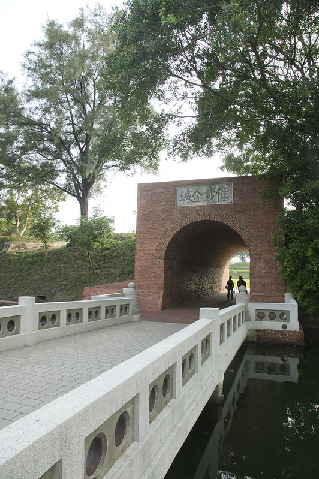
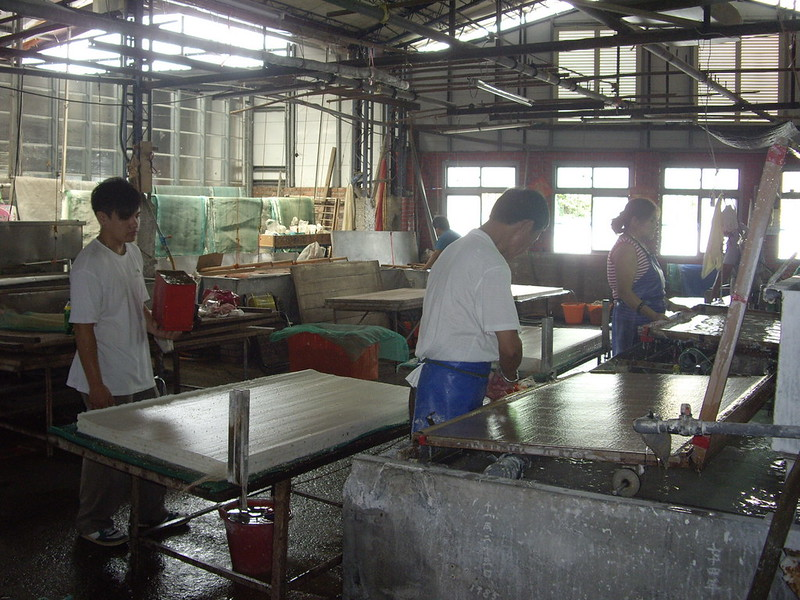

# Evaluation Report for fine-tuned-classify-lr1e-4-meta-llama

## Summary
- Model: fine-tuned-classify-lr1e-4-meta-llama
- Date: 2024-11-28 15:17:25
- Accuracy: 25.49% (13/51)

## Detailed Results

### Image: 華山1914文化創意產業園區-32.jpg
Ground Truth: 華山1914文化創意產業園區

Model Response: 一中街商圈
Correct: ✗

---

### Image: 九族文化村-3.jpg
Ground Truth: 九族文化村

Model Response: 九族文化村
Correct: ✓

---

### Image: 車埕老街-1.jpg
Ground Truth: 車埕老街

Model Response: 九份(九份老街)
Correct: ✗

---

### Image: 台中國家歌劇院-1.jpg
Ground Truth: 台中國家歌劇院

Model Response: 台中市大墩文化中心
Correct: ✗

---

### Image: 國立臺灣美術館-16.jpg
Ground Truth: 國立臺灣美術館

Model Response: 921地震教育園區
Correct: ✗

---

### Image: 輔仁大學-0.jpg
Ground Truth: 輔仁大學

Model Response: 亞洲大學現代美術館
Correct: ✗

---

### Image: 台南市美術館一館-2.jpg
Ground Truth: 台南市美術館一館

Model Response: 二二八和平公園
Correct: ✗

---

### Image: 921地震教育園區-19.jpg
Ground Truth: 921地震教育園區

Model Response: 921地震教育園區
Correct: ✓

---

### Image: 台北101-17.jpg
Ground Truth: 台北101

Model Response: 台北101
Correct: ✓

---

### Image: 貓空纜車-1.jpg
Ground Truth: 貓空纜車

Model Response: 九份
Correct: ✗

---

### Image: 安平古堡-4.jpg
Ground Truth: 安平古堡

Model Response: 一億七千二十九國地
Correct: ✗

---

### Image: 龍虎塔-0.jpg
Ground Truth: 龍虎塔

Model Response: 龍虎塔
Correct: ✓

---

### Image: 澎湖觀音亭-4.jpg
Ground Truth: 澎湖觀音亭

Model Response: 九份(九份老街)
Correct: ✗

---

### Image: 十分老街-0.jpg
Ground Truth: 十分老街

Model Response: 九份(九份老街)
Correct: ✗

---

### Image: 大龍峒保安宮-9.jpg
Ground Truth: 大龍峒保安宮

Model Response: 佛光山佛陀紀念館
Correct: ✗

---

### Image: 小門地質館-21.jpg
Ground Truth: 小門地質館

Model Response: 七股鹽山
Correct: ✗

---

### Image: 三仙台-2.jpg
Ground Truth: 三仙台

Model Response: 三仙台
Correct: ✓

---

### Image: 鳳山縣舊城-9.jpg
Ground Truth: 鳳山縣舊城

Model Response: 億載金城
Correct: ✗

---

### Image: 藍晒圖文創園區-0.jpg
Ground Truth: 藍晒圖文創園區

Model Response: 九份(九份老街)
Correct: ✗

---

### Image: 高雄85大樓-6.jpg
Ground Truth: 高雄85大樓

Model Response: 光華商場
Correct: ✗

---

### Image: 億載金城-2.jpg
Ground Truth: 億載金城

Model Response: 億隆砲臺
Correct: ✗

---

### Image: 亞洲大學現代美術館-0.jpg
Ground Truth: 亞洲大學現代美術館

Model Response: 亞洲大學現代美術館
Correct: ✓

---

### Image: 古坑服務區-3.jpg
Ground Truth: 古坑服務區

Model Response: 中正紀念堂
Correct: ✗

---

### Image: 后里馬場-5.jpg
Ground Truth: 后里馬場

Model Response: 后里馬場
Correct: ✓

---

### Image: 橋頭糖廠-14.jpg
Ground Truth: 橋頭糖廠

Model Response: 國立臺灣博物館
Correct: ✗

---

### Image: 小臺灣-5.jpg
Ground Truth: 小臺灣

Model Response: 國立臺灣文學館
Correct: ✗

---

### Image: 北港觀光大橋-5.jpg
Ground Truth: 北港觀光大橋

Model Response: 國立臺灣博物館
Correct: ✗

---

### Image: 北投圖書館-6.jpg
Ground Truth: 北投圖書館

Model Response: 北投圖書館
Correct: ✓

---

### Image: 雙心石滬-2.jpg
Ground Truth: 雙心石滬

Model Response: 雙心石滬
Correct: ✓

---

### Image: 台中洲際棒球場-3.jpg
Ground Truth: 台中洲際棒球場

Model Response: 這是一個台灣景點台中洲際棒球場。這張圖片中的場地是台中洲際棒球場。以下是詳細描述：

### 建築風格
- **屋頂結構**：場地的屋頂採用大型拱形鋼架設計，具有現代感和開放空間感。
- **看台**：看台呈現藍色調，座位排列整齊，提供觀眾良好的視野。

### 周圍環境
- **草坪**：棒球場中央設有綠色草坪，適合比賽使用。
- **設施**：場內設有完整的體育設施，包括場地標示、選手通道等。

這座球場以其獨特的結構設計和良好的體育設施聞名，適合舉辦各類大型體育賽事和活動。
Correct: ✓

---

### Image: 小門地質館-0.jpg
Ground Truth: 小門地質館

Model Response: 921地震教育園區
Correct: ✗

---

### Image: 冬山河親水公園-0.jpg
Ground Truth: 冬山河親水公園

Model Response: 921地震教育園區
Correct: ✗

---

### Image: 台中公園-4.jpg
Ground Truth: 台中公園

Model Response: 台中公園。這張圖片中的景點是台中公園。以下是圖片中的細節描述：

1. **建築與設施**：
   - 圖中間的建築物是一座湖中小島的涼亭，具有傳統中式建築風格，屋頂呈現優美的曲線。
   - 涼亭內部有燈光，顯得溫馨而吸引人。

2. **自然環境**：
   - 湖水清澈，倒映出涼亭和周圍的樹木，形成美麗的鏡面效果。
   - 湖面上方的天空呈現出壯觀的彩虹色，可能是日出或日落時的光影。

3. **周圍景觀**：
   - 湖的周圍有豐富的綠色植被，包括多種樹木和灌木。
   - 遠處可以看到城市的建築物，與自然景觀形成對比。

台中公園是市中心的一個重要休閒場所，提供市民一個放鬆和接觸自然的空間。
Correct: ✓

---

### Image: 衛武營都會公園-0.jpg
Ground Truth: 衛武營都會公園

Model Response: 921地震教育園區
Correct: ✗

---

### Image: 蘭陽博物館-6.jpg
Ground Truth: 蘭陽博物館

Model Response: 921地震教育園區
Correct: ✗

---

### Image: 大安森林公園-0.jpg
Ground Truth: 大安森林公園

Model Response: 921地震教育園區
Correct: ✗

---

### Image: 澄清湖棒球場-6.jpg
Ground Truth: 澄清湖棒球場

Model Response: 台中洲際棒球場
Correct: ✗

---

### Image: 臺北車站-2.jpg
Ground Truth: 臺北車站

Model Response: 國父紀念館
Correct: ✗

---

### Image: 高美濕地-7.jpg
Ground Truth: 高美濕地

Model Response: 七股鹽山
Correct: ✗

---

### Image: 迪化街-11.jpg
Ground Truth: 迪化街

Model Response: 九份(九份老街)
Correct: ✗

---

### Image: 林百貨-10.jpg
Ground Truth: 林百貨

Model Response: 一中街商圈
Correct: ✗

---

### Image: 小叮噹科學遊樂區-2.jpg
Ground Truth: 小叮噹科學遊樂區

Model Response: 小叮噹科學遊樂區
Correct: ✓

---

### Image: 小人國主題樂園-17.jpg
Ground Truth: 小人國主題樂園

Model Response: 小人國
Correct: ✗

---

### Image: 故宮南院-0.jpg
Ground Truth: 故宮南院

Model Response: 921地震教育園區
Correct: ✗

---

### Image: 廣興紙寮-11.jpg
Ground Truth: 廣興紙寮

Model Response: 九份(九份老街)
Correct: ✗

---

### Image: 草悟道-21.jpg
Ground Truth: 草悟道

Model Response: 一中街商圈
Correct: ✗

---

### Image: 澎湖跨海大橋-3.jpg
Ground Truth: 澎湖跨海大橋

Model Response: 九份(九份老街)
Correct: ✗

---

### Image: 台北小巨蛋-1.jpg
Ground Truth: 台北小巨蛋

Model Response: 台北小巨蛋
Correct: ✓

---

### Image: 水漾森林-8.jpg
Ground Truth: 水漾森林

Model Response: 十分瀑布
Correct: ✗

---

### Image: 草悟道-9.jpg
Ground Truth: 草悟道

Model Response: 二二八和平公園
Correct: ✗

---

### Image: 光華商場-6.jpg
Ground Truth: 光華商場

Model Response: 北投圖書館
Correct: ✗

---

