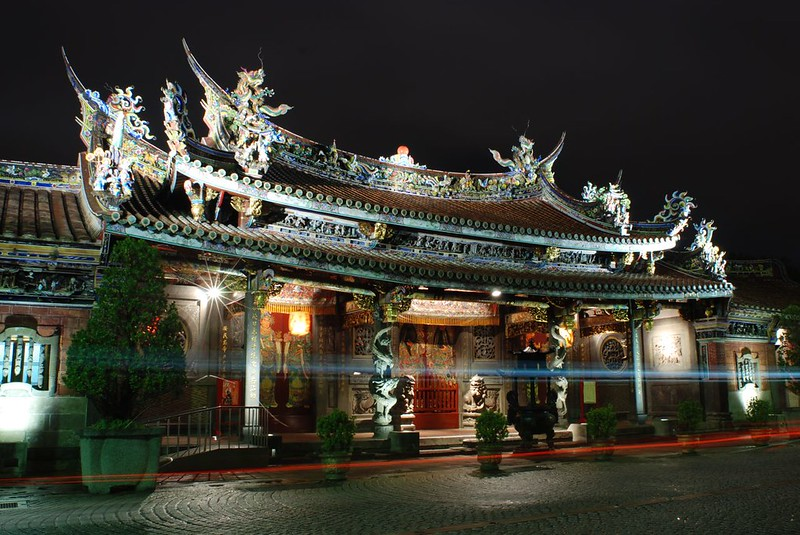
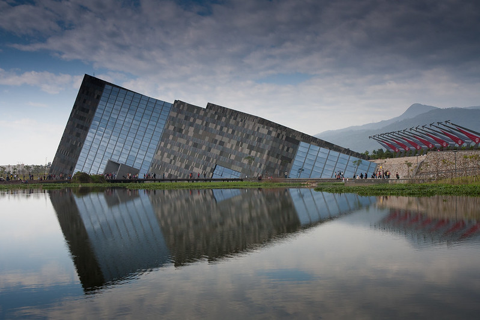
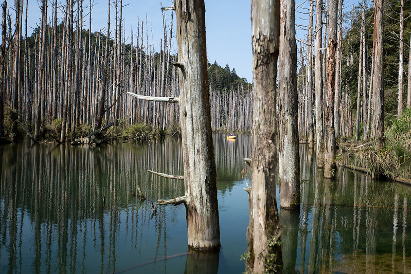
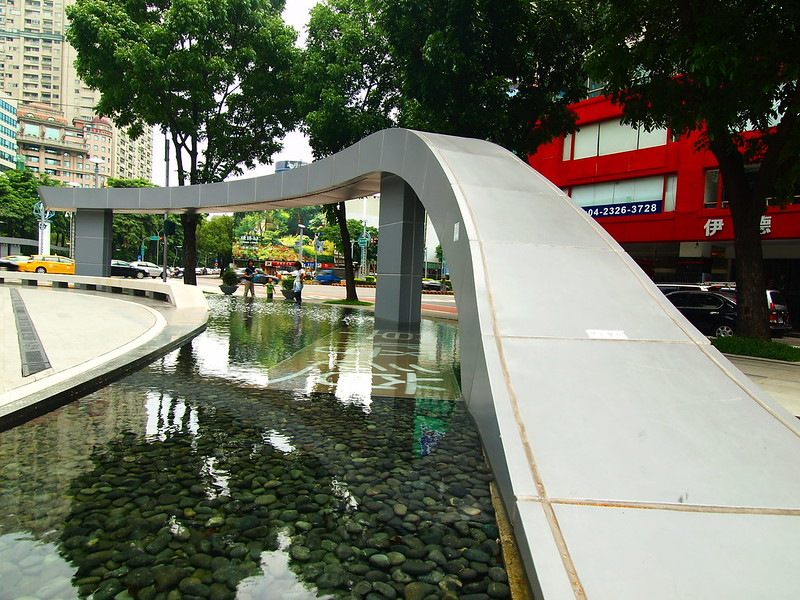

# Evaluation Report for fine-tuned-full_param_5epoch-lr1e-4-meta-llama

## Summary
- Model: fine-tuned-full_param_5epoch-lr1e-4-meta-llama
- Date: 2024-11-28 15:17:25
- Accuracy: 0.00% (0/51)

## Detailed Results

### Image: 華山1914文化創意產業園區-32.jpg
Ground Truth: 華山1914文化創意產業園區

Model Response: 如果
Correct: ✗

---

### Image: 九族文化村-3.jpg
Ground Truth: 九族文化村

Model Response: 如果
Correct: ✗

---

### Image: 車埕老街-1.jpg
Ground Truth: 車埕老街

Model Response: 成為參觀時進索！
Correct: ✗

---

### Image: 台中國家歌劇院-1.jpg
Ground Truth: 台中國家歌劇院

Model Response: 如果
Correct: ✗

---

### Image: 國立臺灣美術館-16.jpg
Ground Truth: 國立臺灣美術館

Model Response: 確確確確對確參觀留細細或結設的細細相結效果！
Correct: ✗

---

### Image: 輔仁大學-0.jpg
Ground Truth: 輔仁大學

Model Response: 如果
Correct: ✗

---

### Image: 台南市美術館一館-2.jpg
Ground Truth: 台南市美術館一館

Model Response: 成為進一步確認， grateful融合增添細細相融融！
Correct: ✗

---

### Image: 921地震教育園區-19.jpg
Ground Truth: 921地震教育園區

Model Response: 如果
Correct: ✗

---

### Image: 台北101-17.jpg
Ground Truth: 台北101

Model Response: 如果
Correct: ✗

---

### Image: 貓空纜車-1.jpg
Ground Truth: 貓空纜車

Model Response: 如果若
Correct: ✗

---

### Image: 安平古堡-4.jpg
Ground Truth: 安平古堡

Model Response: 確確確對對確確特別查受確認地更進一步查受地資好的參觀！
Correct: ✗

---

### Image: 龍虎塔-0.jpg
Ground Truth: 龍虎塔

Model Response: 圍有獨細節，吸建融！
Correct: ✗

---

### Image: 澎湖觀音亭-4.jpg
Ground Truth: 澎湖觀音亭

Model Response: 確確確確確確更進一步查受與細細相留！
Correct: ✗

---

### Image: 十分老街-0.jpg
Ground Truth: 十分老街

Model Response: 樣和細細細細細值得對進入。如果
Correct: ✗

---

### Image: 大龍峒保安宮-9.jpg
Ground Truth: 大龍峒保安宮

Model Response: 如果
Correct: ✗

---

### Image: 小門地質館-21.jpg
Ground Truth: 小門地質館

Model Response: 如果
Correct: ✗

---

### Image: 三仙台-2.jpg
Ground Truth: 三仙台

Model Response: 確確進對確確確進查受地體驗。
Correct: ✗

---

### Image: 鳳山縣舊城-9.jpg
Ground Truth: 鳳山縣舊城

Model Response: 確確確確確能進受到保護地的細細細細細以細細相融！
Correct: ✗

---

### Image: 藍晒圖文創園區-0.jpg
Ground Truth: 藍晒圖文創園區

Model Response: 
Correct: ✗

---

### Image: 高雄85大樓-6.jpg
Ground Truth: 高雄85大樓

Model Response: 圍有適�設的相刻融，
Correct: ✗

---

### Image: 億載金城-2.jpg
Ground Truth: 億載金城

Model Response: 對想要參觀時查受進一步查受進參受與結作以增進拍好認查融索。
Correct: ✗

---

### Image: 亞洲大學現代美術館-0.jpg
Ground Truth: 亞洲大學現代美術館

Model Response: 
Correct: ✗

---

### Image: 古坑服務區-3.jpg
Ground Truth: 古坑服務區

Model Response: 交通以確確對確確證細細充！
Correct: ✗

---

### Image: 后里馬場-5.jpg
Ground Truth: 后里馬場

Model Response: 如果查看遊客查外，
Correct: ✗

---

### Image: 橋頭糖廠-14.jpg
Ground Truth: 橋頭糖廠

Model Response: 確確確有確確細細細充，保持參觀！
Correct: ✗

---

### Image: 小臺灣-5.jpg
Ground Truth: 小臺灣

Model Response: 確確確確保護地能更準確地了解地細細細細細相細下。
Correct: ✗

---

### Image: 北港觀光大橋-5.jpg
Ground Truth: 北港觀光大橋

Model Response: 
Correct: ✗

---

### Image: 北投圖書館-6.jpg
Ground Truth: 北投圖書館

Model Response: 如果
Correct: ✗

---

### Image: 雙心石滬-2.jpg
Ground Truth: 雙心石滬

Model Response: 
Correct: ✗

---

### Image: 台中洲際棒球場-3.jpg
Ground Truth: 台中洲際棒球場

Model Response: 符合周圍的整遊玩！
Correct: ✗

---

### Image: 小門地質館-0.jpg
Ground Truth: 小門地質館

Model Response: 如果
Correct: ✗

---

### Image: 冬山河親水公園-0.jpg
Ground Truth: 冬山河親水公園

Model Response: 圍有細細值融！
Correct: ✗

---

### Image: 台中公園-4.jpg
Ground Truth: 台中公園

Model Response: 如果查受進快， versa有對適遊受特殊的認驗，.swing值得增得！
Correct: ✗

---

### Image: 衛武營都會公園-0.jpg
Ground Truth: 衛武營都會公園

Model Response: 交通資好的現作細備拍拍受獨特與細細來結效果，將融得有充好進進！
Correct: ✗

---

### Image: 蘭陽博物館-6.jpg
Ground Truth: 蘭陽博物館

Model Response: 如果
Correct: ✗

---

### Image: 大安森林公園-0.jpg
Ground Truth: 大安森林公園

Model Response: 確進進參觀，保持細細相去， able去結相有特別的選遊客！
Correct: ✗

---

### Image: 澄清湖棒球場-6.jpg
Ground Truth: 澄清湖棒球場

Model Response: 確確確進進融，建議查受安全。如果
Correct: ✗

---

### Image: 臺北車站-2.jpg
Ground Truth: 臺北車站

Model Response: 確認這是非常受融行，請再受相結效果，歡受不時間。
Correct: ✗

---

### Image: 高美濕地-7.jpg
Ground Truth: 高美濕地

Model Response: 具備相符合細細充！
Correct: ✗

---

### Image: 迪化街-11.jpg
Ground Truth: 迪化街

Model Response: 
Correct: ✗

---

### Image: 林百貨-10.jpg
Ground Truth: 林百貨

Model Response: 實進融融多值進以進索和融！
Correct: ✗

---

### Image: 小叮噹科學遊樂區-2.jpg
Ground Truth: 小叮噹科學遊樂區

Model Response: 如果
Correct: ✗

---

### Image: 小人國主題樂園-17.jpg
Ground Truth: 小人國主題樂園

Model Response: 
Correct: ✗

---

### Image: 故宮南院-0.jpg
Ground Truth: 故宮南院

Model Response: 還能夠進融增進進進！
Correct: ✗

---

### Image: 廣興紙寮-11.jpg
Ground Truth: 廣興紙寮

Model Response: 圍有細細細充！
Correct: ✗

---

### Image: 草悟道-21.jpg
Ground Truth: 草悟道

Model Response: 如果
Correct: ✗

---

### Image: 澎湖跨海大橋-3.jpg
Ground Truth: 澎湖跨海大橋

Model Response: 麼對確對對確確確進查受相相建， interested�的細細相值，因若能受到進對好航的細細節！
Correct: ✗

---

### Image: 台北小巨蛋-1.jpg
Ground Truth: 台北小巨蛋

Model Response: 如果
Correct: ✗

---

### Image: 水漾森林-8.jpg
Ground Truth: 水漾森林

Model Response: 確進進入的細細細相結與將有特別特殊！
Correct: ✗

---

### Image: 草悟道-9.jpg
Ground Truth: 草悟道

Model Response: 樣的相結和相認融，建以讓適合拍照參觀！
Correct: ✗

---

### Image: 光華商場-6.jpg
Ground Truth: 光華商場

Model Response: 攞獨特的認憞性，.swing有適合拍照和通資節，.swing值得融！
Correct: ✗

---

