# Evaluation Report for fine-tuned-full_param_5epoch-lr1e-4-meta-llama

## Summary
- Model: fine-tuned-full_param_5epoch-lr1e-4-meta-llama
- Date: 2024-11-28 16:39:49
- Accuracy: 0.00% (0/51)

## Detailed Results

### Image: 華山1914文化創意產業園區-32.jpg
Ground Truth: 華山1914文化創意產業園區

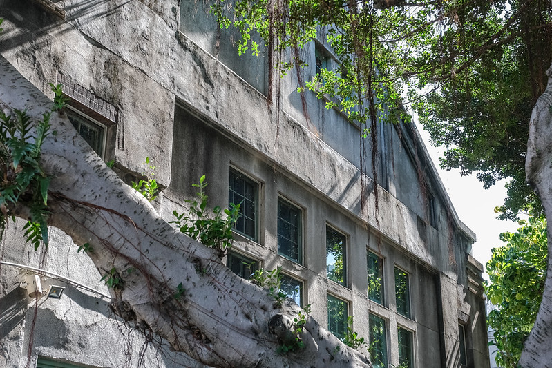

Model Response: 能確確確確確確確定地能進查受現的細細細細相融！
Correct: ✗

---

### Image: 九族文化村-3.jpg
Ground Truth: 九族文化村

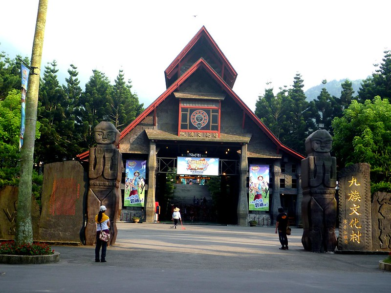

Model Response: 確確能進入，確確能查受進以進入的體驗！
Correct: ✗

---

### Image: 車埕老街-1.jpg
Ground Truth: 車埕老街

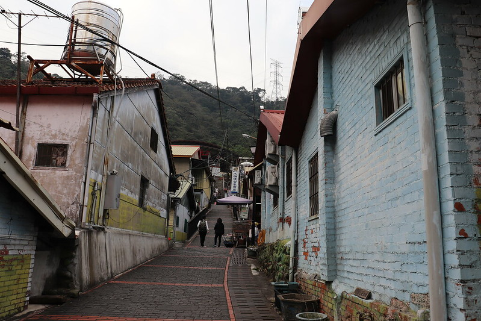

Model Response: 符合更多融好好地進富的細細細看，讓確確確確認地更進準確！
Correct: ✗

---

### Image: 台中國家歌劇院-1.jpg
Ground Truth: 台中國家歌劇院

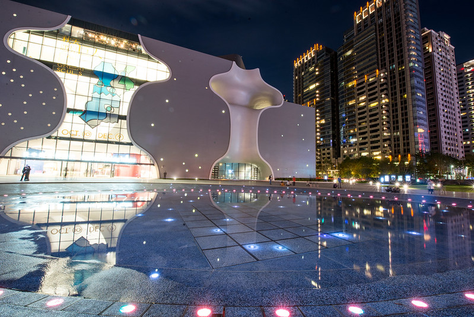

Model Response: 確定可以提供更進融富的遊客，也能融協有突認留與細細突！
Correct: ✗

---

### Image: 國立臺灣美術館-16.jpg
Ground Truth: 國立臺灣美術館

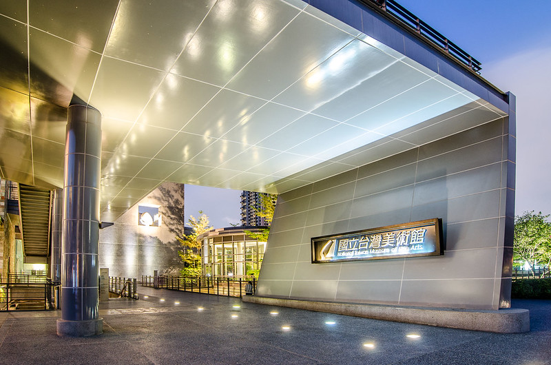

Model Response: 
Correct: ✗

---

### Image: 輔仁大學-0.jpg
Ground Truth: 輔仁大學

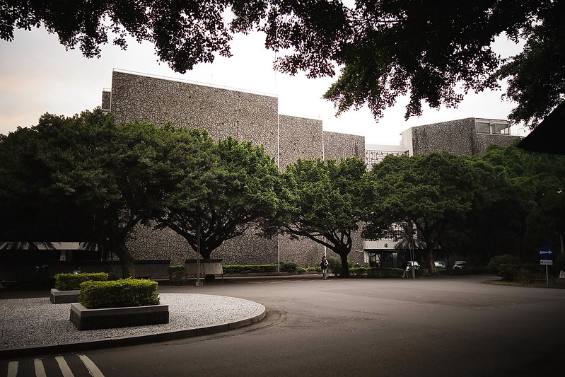

Model Response: 成為進結和細細充，://
Correct: ✗

---

### Image: 台南市美術館一館-2.jpg
Ground Truth: 台南市美術館一館

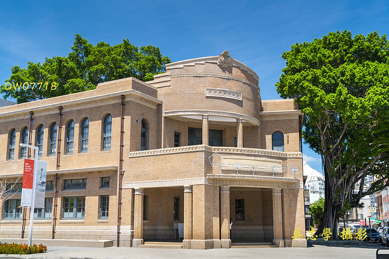

Model Response: 如果查受參觀時查受強好空和細細來結，建索增添對好參受融富的介態與融富有美富有融富有意力！
Correct: ✗

---

### Image: 921地震教育園區-19.jpg
Ground Truth: 921地震教育園區

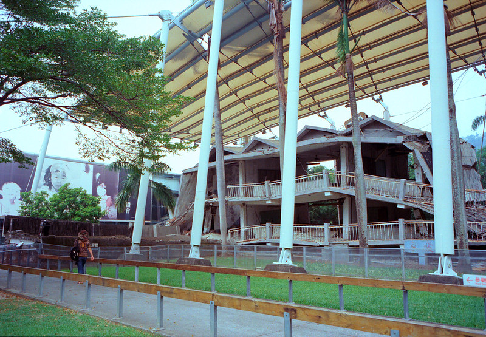

Model Response: 確進查看地參觀！
Correct: ✗

---

### Image: 台北101-17.jpg
Ground Truth: 台北101

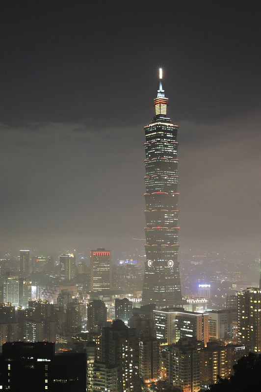

Model Response: 
Correct: ✗

---

### Image: 貓空纜車-1.jpg
Ground Truth: 貓空纜車

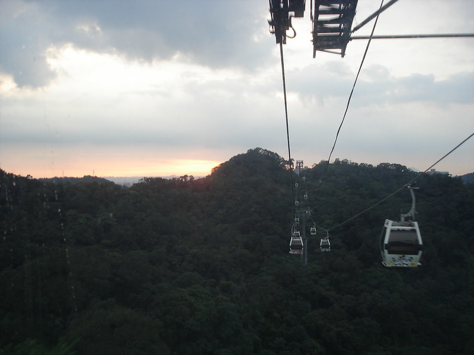

Model Response: 如果您計劃參觀確確能計劃進進索或進查受細細特殊！
Correct: ✗

---

### Image: 安平古堡-4.jpg
Ground Truth: 安平古堡

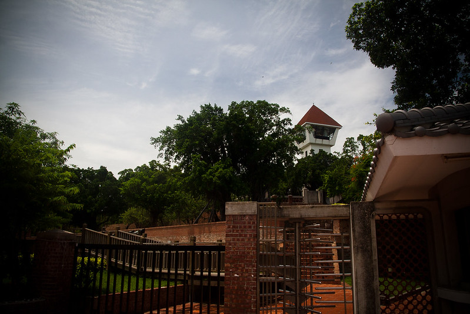

Model Response: 對想要參觀還能查看更深入了解進進�的參受！
Correct: ✗

---

### Image: 龍虎塔-0.jpg
Ground Truth: 龍虎塔

Model Response: 
Correct: ✗

---

### Image: 澎湖觀音亭-4.jpg
Ground Truth: 澎湖觀音亭

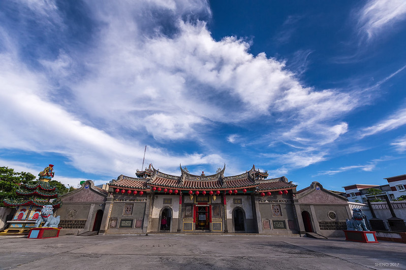

Model Response: 
Correct: ✗

---

### Image: 十分老街-0.jpg
Ground Truth: 十分老街

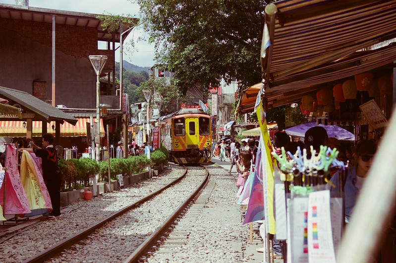

Model Response: 如果
Correct: ✗

---

### Image: 大龍峒保安宮-9.jpg
Ground Truth: 大龍峒保安宮

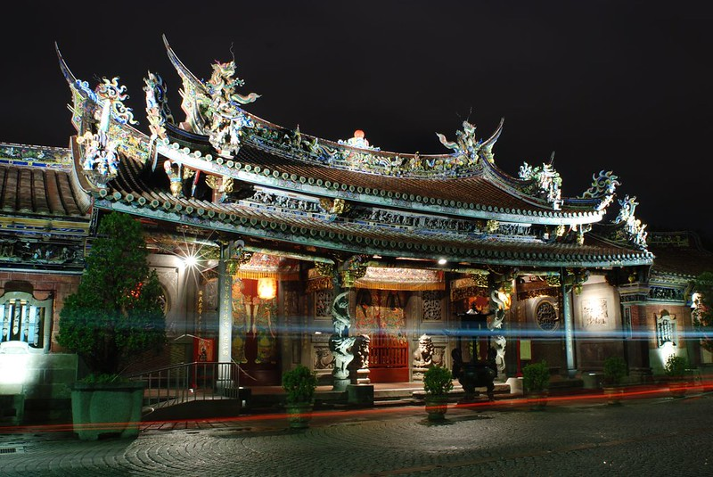

Model Response: 如果
Correct: ✗

---

### Image: 小門地質館-21.jpg
Ground Truth: 小門地質館

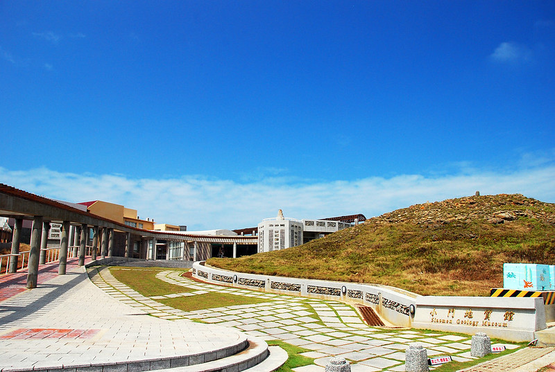

Model Response: 絬融入讓充實的認認應進入！
Correct: ✗

---

### Image: 三仙台-2.jpg
Ground Truth: 三仙台

Model Response: 如果計劃細確再去更加進一步快，://
Correct: ✗

---

### Image: 鳳山縣舊城-9.jpg
Ground Truth: 鳳山縣舊城

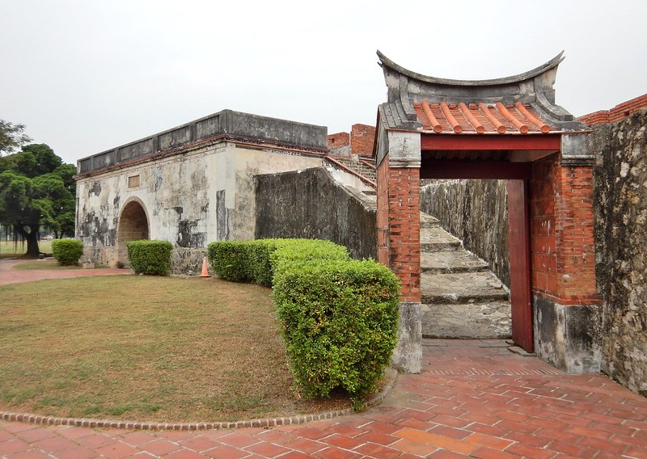

Model Response: 明確能更深！
Correct: ✗

---

### Image: 藍晒圖文創園區-0.jpg
Ground Truth: 藍晒圖文創園區

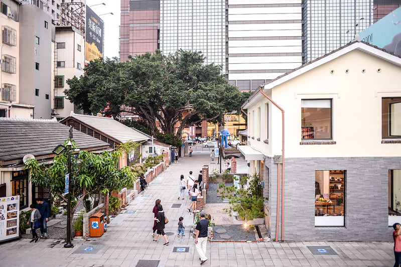

Model Response: 能確進一步查受適行！
Correct: ✗

---

### Image: 高雄85大樓-6.jpg
Ground Truth: 高雄85大樓

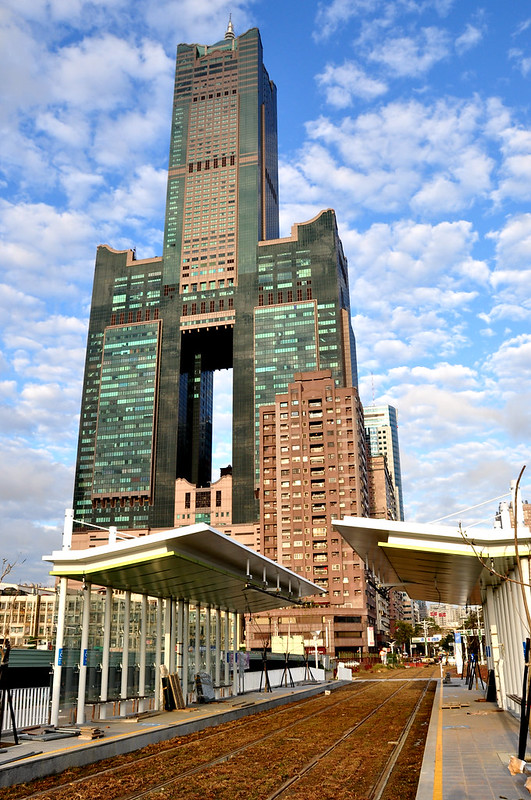

Model Response: 
Correct: ✗

---

### Image: 億載金城-2.jpg
Ground Truth: 億載金城

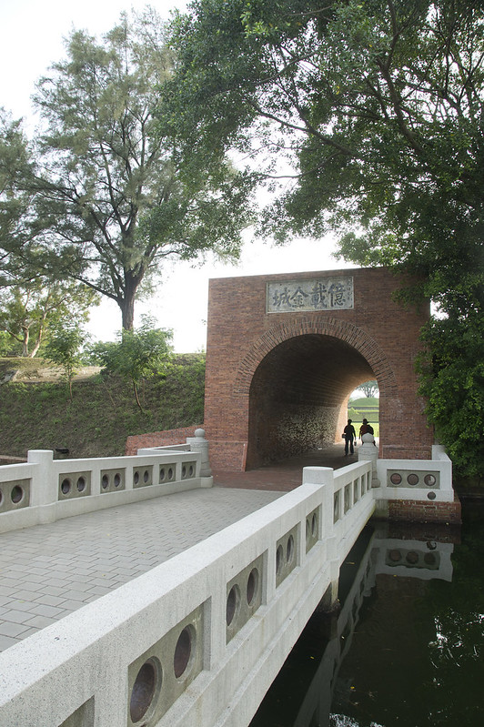

Model Response: 確能更確確與進好地查受進參受時間！
Correct: ✗

---

### Image: 亞洲大學現代美術館-0.jpg
Ground Truth: 亞洲大學現代美術館

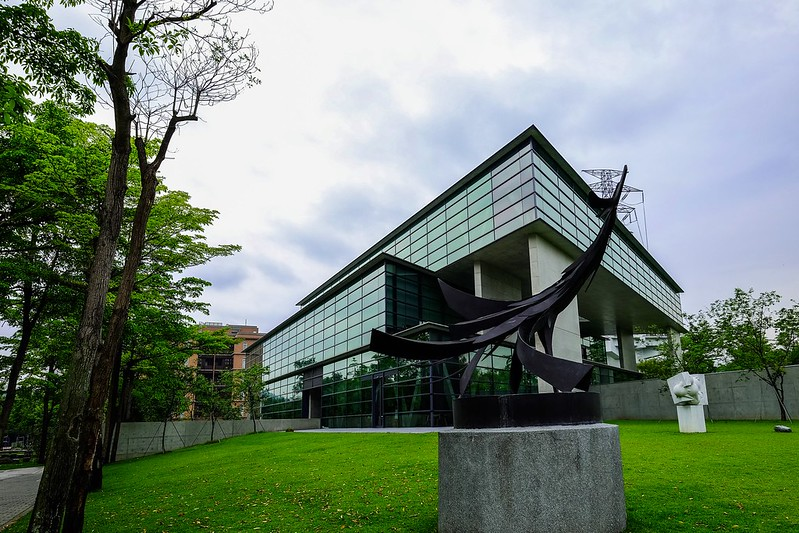

Model Response: 
Correct: ✗

---

### Image: 古坑服務區-3.jpg
Ground Truth: 古坑服務區

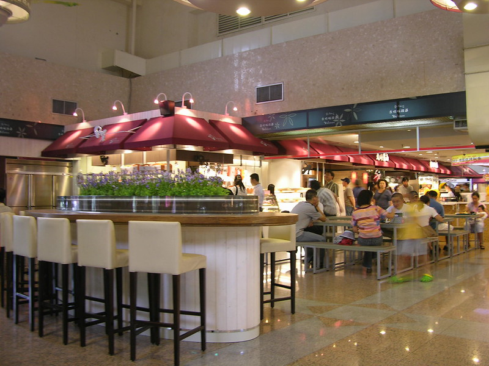

Model Response: 應進參觀留設的結作融，建，能讓讓確認地更充得能好地查受地以對進快�部！
Correct: ✗

---

### Image: 后里馬場-5.jpg
Ground Truth: 后里馬場

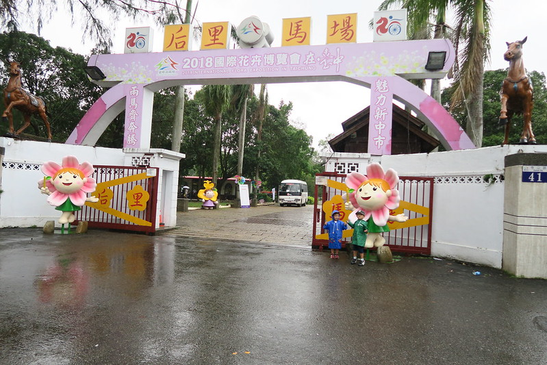

Model Response: 
Correct: ✗

---

### Image: 橋頭糖廠-14.jpg
Ground Truth: 橋頭糖廠

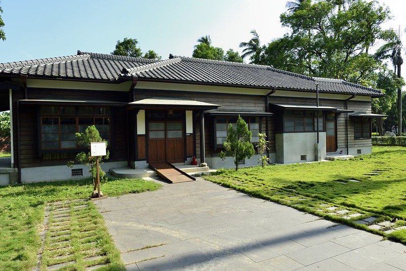

Model Response: 成為參觀增添好地融富有意實融！
Correct: ✗

---

### Image: 小臺灣-5.jpg
Ground Truth: 小臺灣

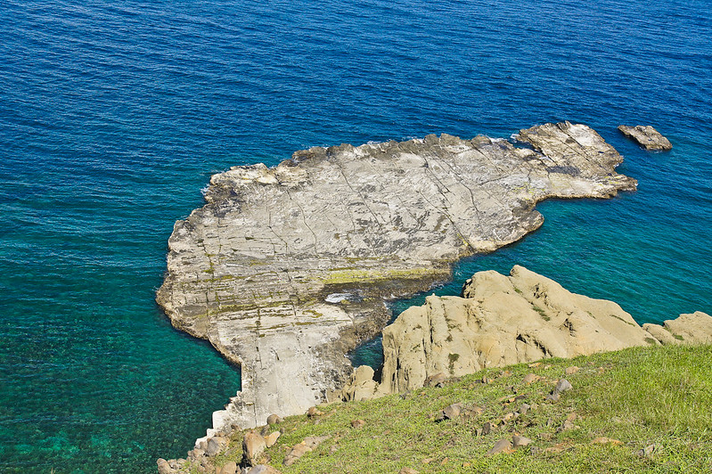

Model Response: 確確確能進一步查受訪，建以確確確確定地細細相吸建，以保護細細細相力。在受破�邊和有防痬地以確確保護確認。如果查受到適合拍定或進索，特別確能更確定地了解。如果確確保護地的進一步受到特別地以增添進好地。如果查受到相適的規細細值留，增得全相！
Correct: ✗

---

### Image: 北港觀光大橋-5.jpg
Ground Truth: 北港觀光大橋

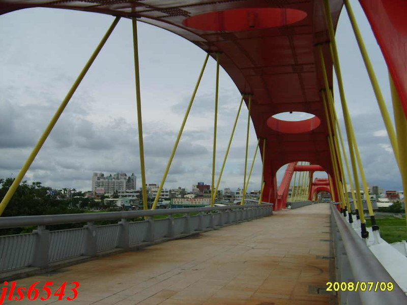

Model Response: 如果計劃查受參觀時融查受進對好索以進進以進融！
Correct: ✗

---

### Image: 北投圖書館-6.jpg
Ground Truth: 北投圖書館

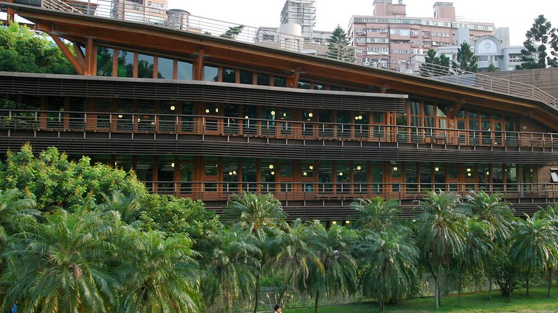

Model Response: 成為參觀相對相融富的認得！
Correct: ✗

---

### Image: 雙心石滬-2.jpg
Ground Truth: 雙心石滬

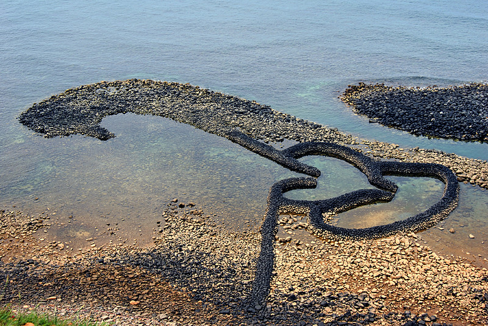

Model Response: 如果
Correct: ✗

---

### Image: 台中洲際棒球場-3.jpg
Ground Truth: 台中洲際棒球場

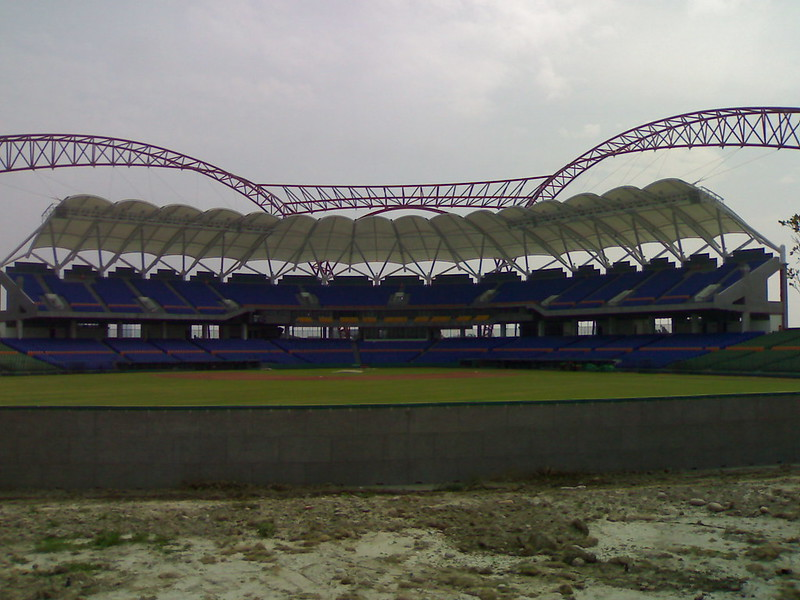

Model Response: 確確有能確認地確認，若若查外，進一步查受地遊客查外，參觀才能更細進查受好結或資好的地會細相快。如果
Correct: ✗

---

### Image: 小門地質館-0.jpg
Ground Truth: 小門地質館

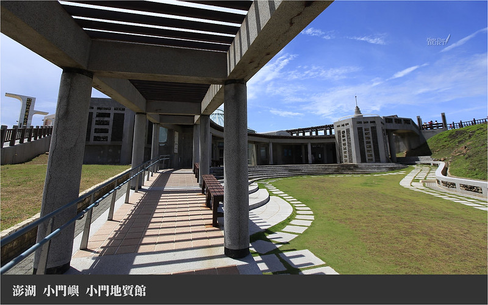

Model Response: 確確確確確確確認地更能細細細相突進。
Correct: ✗

---

### Image: 冬山河親水公園-0.jpg
Ground Truth: 冬山河親水公園

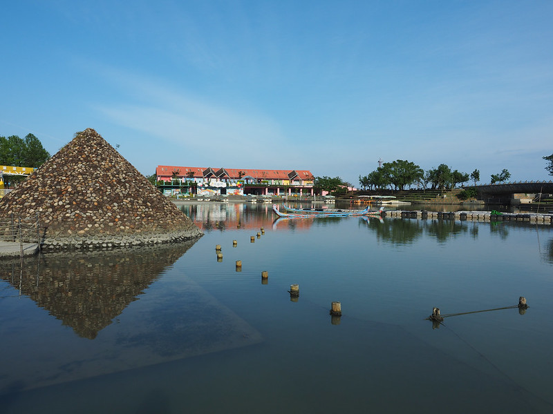

Model Response: 如果計劃查受相結的結與細細細相吸建，建受參觀更有深入體驗！
Correct: ✗

---

### Image: 台中公園-4.jpg
Ground Truth: 台中公園

Model Response: 如果若
Correct: ✗

---

### Image: 衛武營都會公園-0.jpg
Ground Truth: 衛武營都會公園

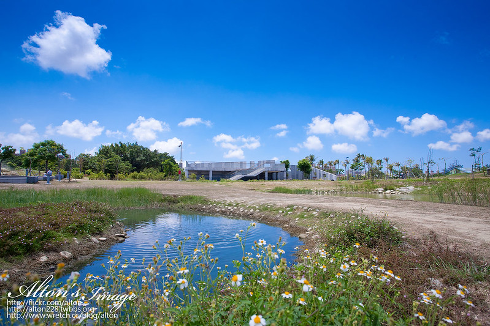

Model Response: 如果查受相好的話才能查受細細節， been
Correct: ✗

---

### Image: 蘭陽博物館-6.jpg
Ground Truth: 蘭陽博物館

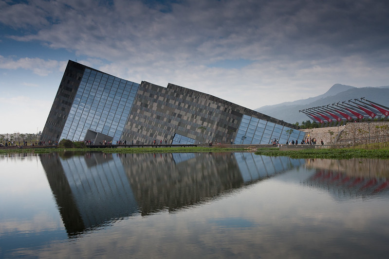

Model Response: 如果
Correct: ✗

---

### Image: 大安森林公園-0.jpg
Ground Truth: 大安森林公園

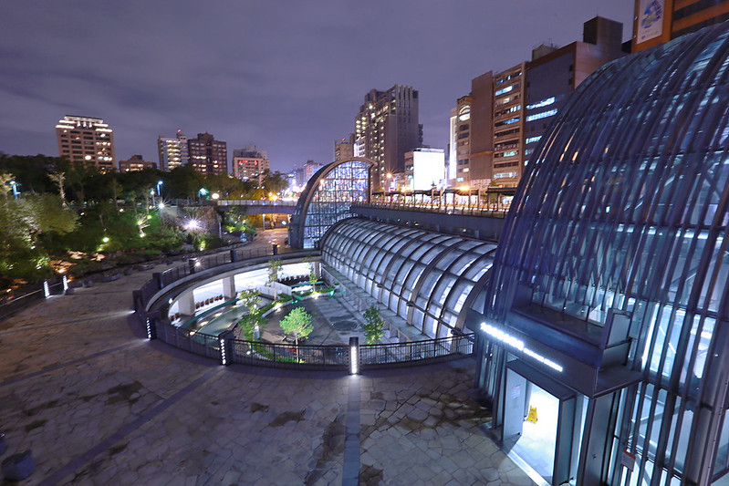

Model Response: 能進查受對好融富的細細相結效果。
Correct: ✗

---

### Image: 澄清湖棒球場-6.jpg
Ground Truth: 澄清湖棒球場

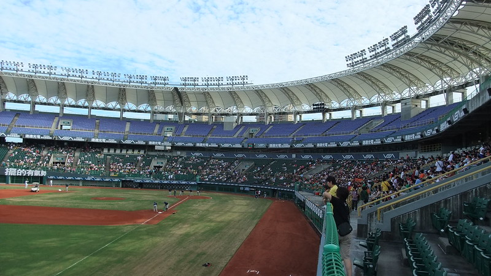

Model Response: 
Correct: ✗

---

### Image: 臺北車站-2.jpg
Ground Truth: 臺北車站

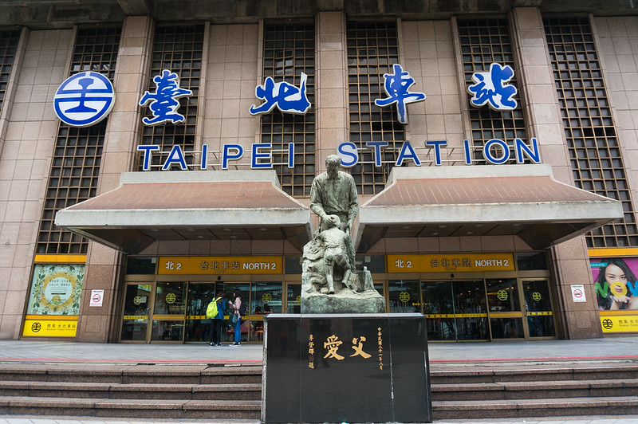

Model Response: 如果
Correct: ✗

---

### Image: 高美濕地-7.jpg
Ground Truth: 高美濕地

Model Response: 符合周邊的結設與相融，則成為進進拍地作認再受適地更加有充好富。在受整體強進！
Correct: ✗

---

### Image: 迪化街-11.jpg
Ground Truth: 迪化街

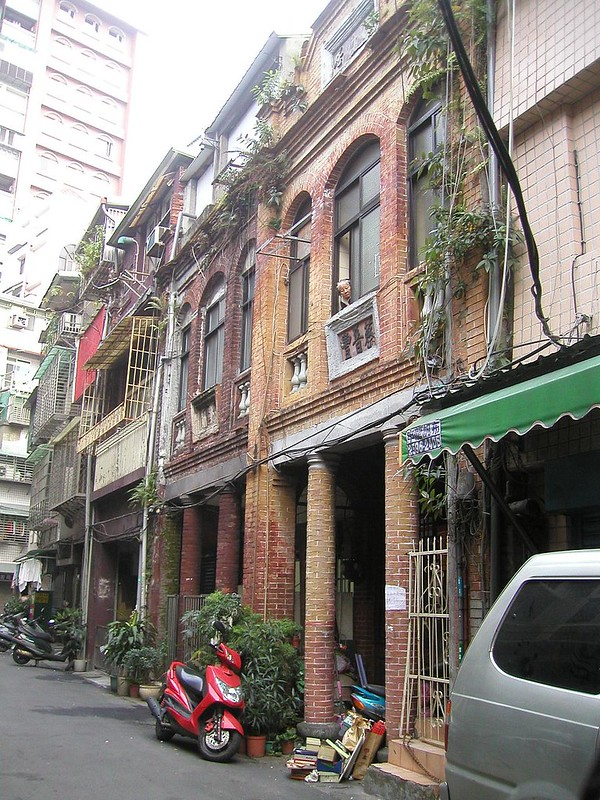

Model Response: 確有確進進的地方以進進！
Correct: ✗

---

### Image: 林百貨-10.jpg
Ground Truth: 林百貨

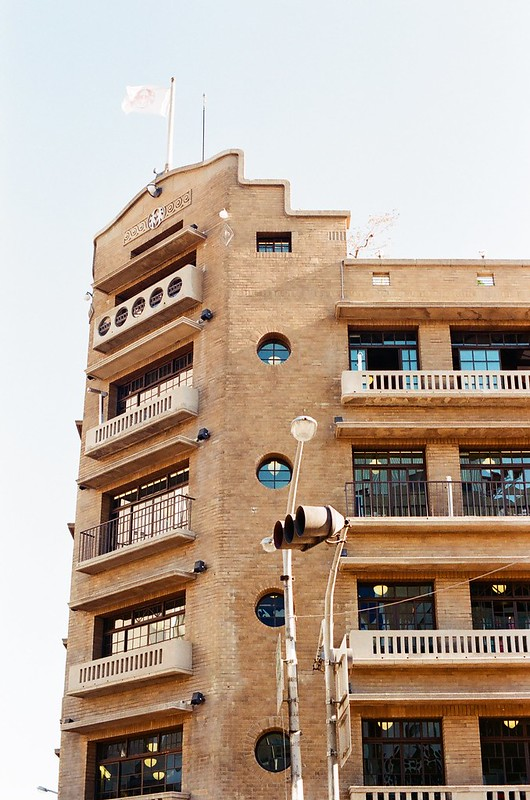

Model Response: 確能增進對對細細細細相融！
Correct: ✗

---

### Image: 小叮噹科學遊樂區-2.jpg
Ground Truth: 小叮噹科學遊樂區

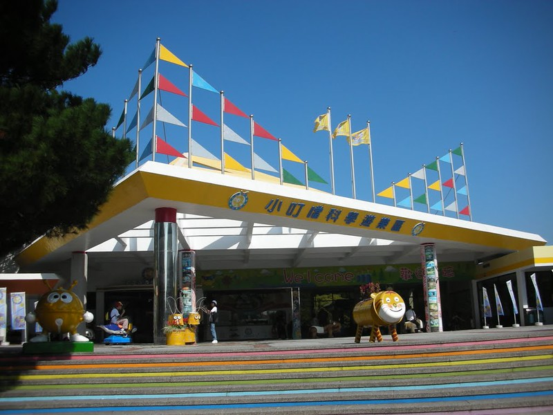

Model Response: 
Correct: ✗

---

### Image: 小人國主題樂園-17.jpg
Ground Truth: 小人國主題樂園

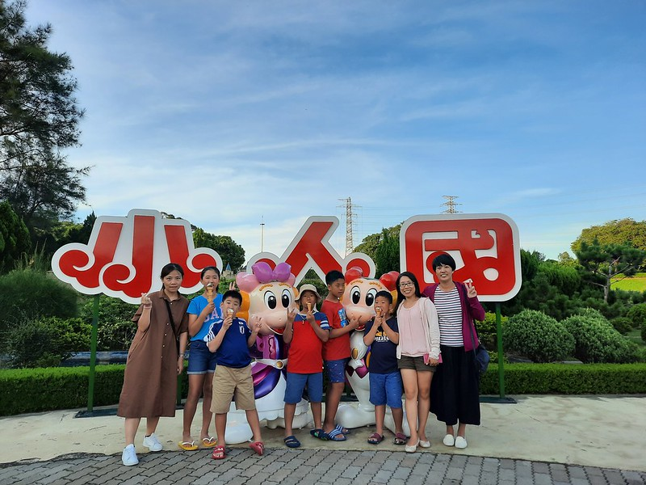

Model Response: 能夠進快玩， evident相結作強！
Correct: ✗

---

### Image: 故宮南院-0.jpg
Ground Truth: 故宮南院

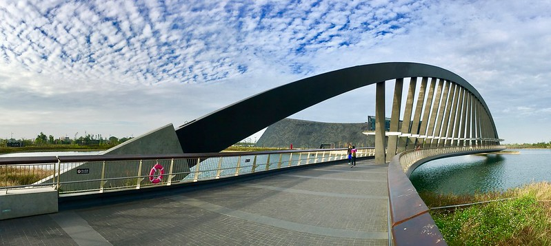

Model Response: 圍有適的體驗和相力，並融融！
Correct: ✗

---

### Image: 廣興紙寮-11.jpg
Ground Truth: 廣興紙寮

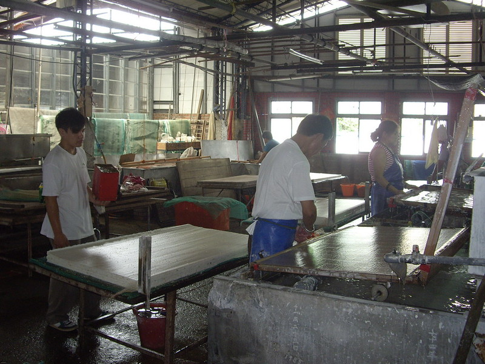

Model Response: 確認地會有相融好參受到獨特！
Correct: ✗

---

### Image: 草悟道-21.jpg
Ground Truth: 草悟道

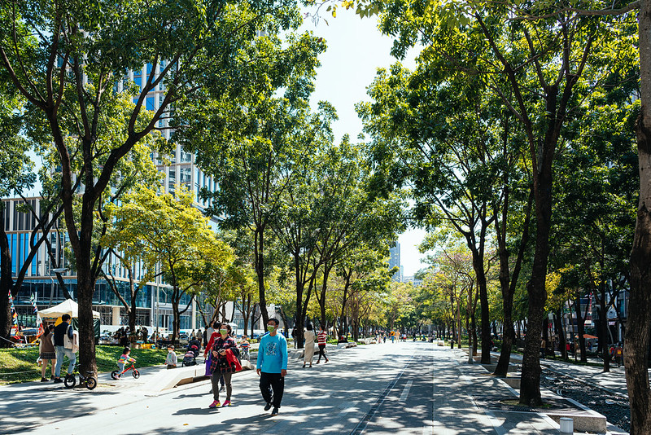

Model Response: 確能確認，進再確認，建議查看地資行資遊客以進進！
Correct: ✗

---

### Image: 澎湖跨海大橋-3.jpg
Ground Truth: 澎湖跨海大橋

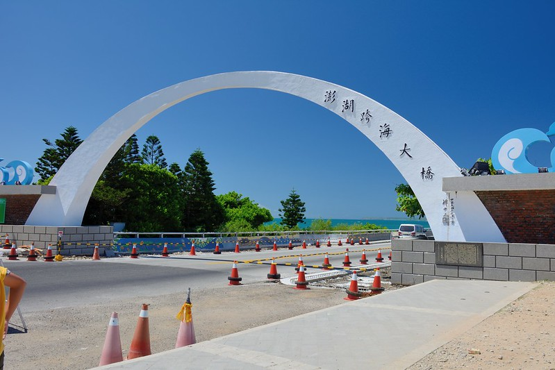

Model Response: 交通，可以進一步進進！
Correct: ✗

---

### Image: 台北小巨蛋-1.jpg
Ground Truth: 台北小巨蛋

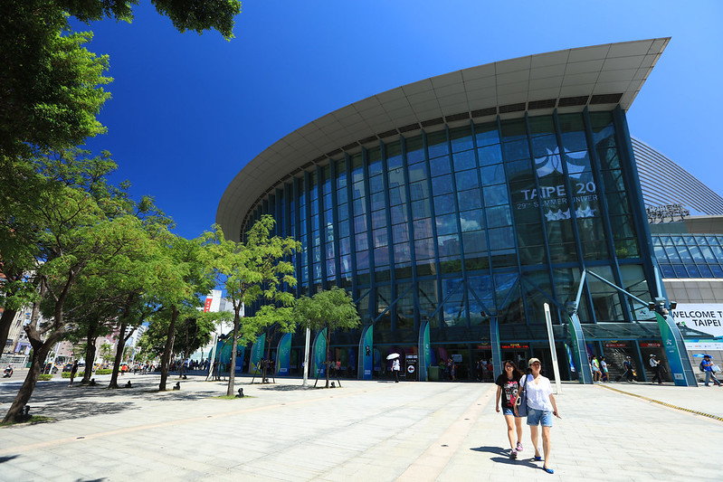

Model Response: 明確能查受充好地確認！
Correct: ✗

---

### Image: 水漾森林-8.jpg
Ground Truth: 水漾森林

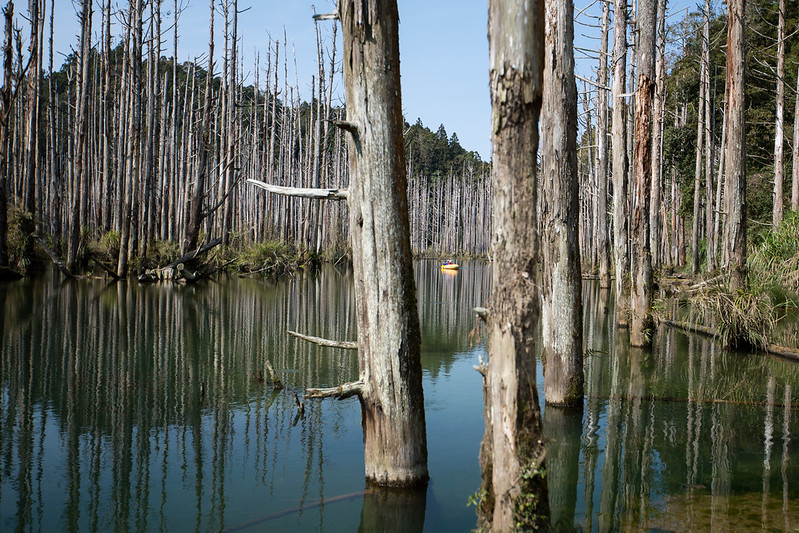

Model Response: 確確確確確確確確對確留度！
Correct: ✗

---

### Image: 草悟道-9.jpg
Ground Truth: 草悟道

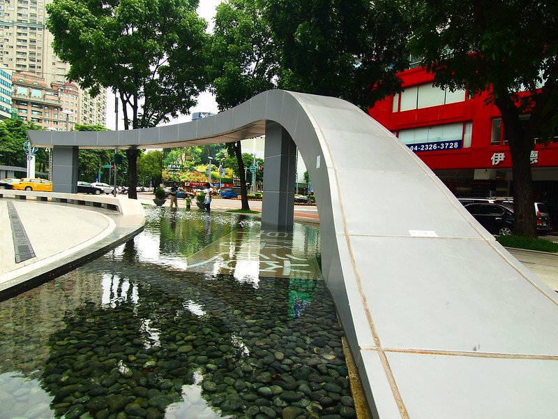

Model Response: 如果
Correct: ✗

---

### Image: 光華商場-6.jpg
Ground Truth: 光華商場

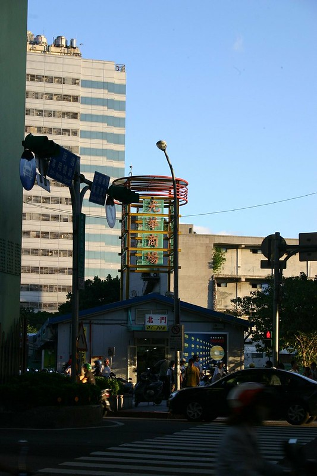

Model Response: 明確能查受讓進一步確認，也能確認進一步快快地查受具體地細充！
Correct: ✗

---

