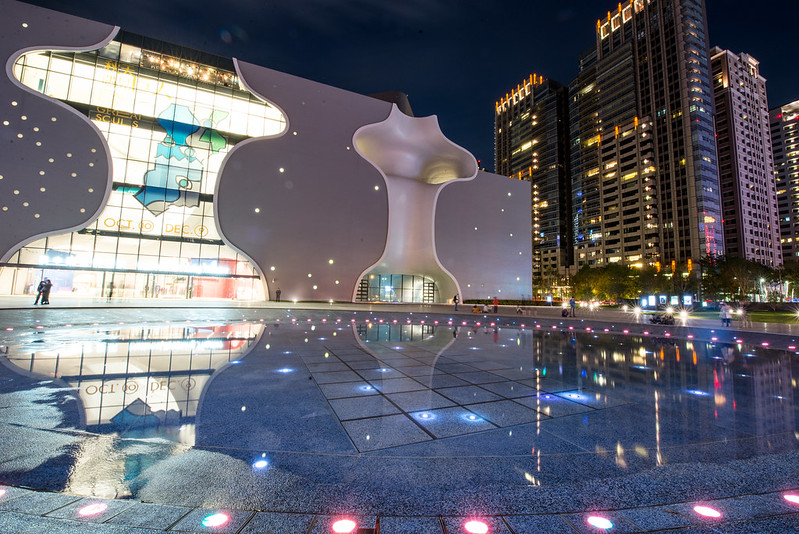
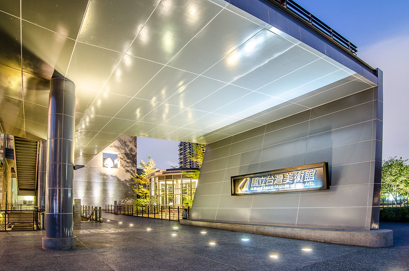
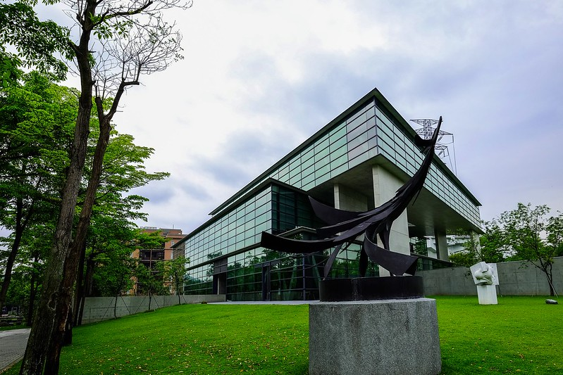
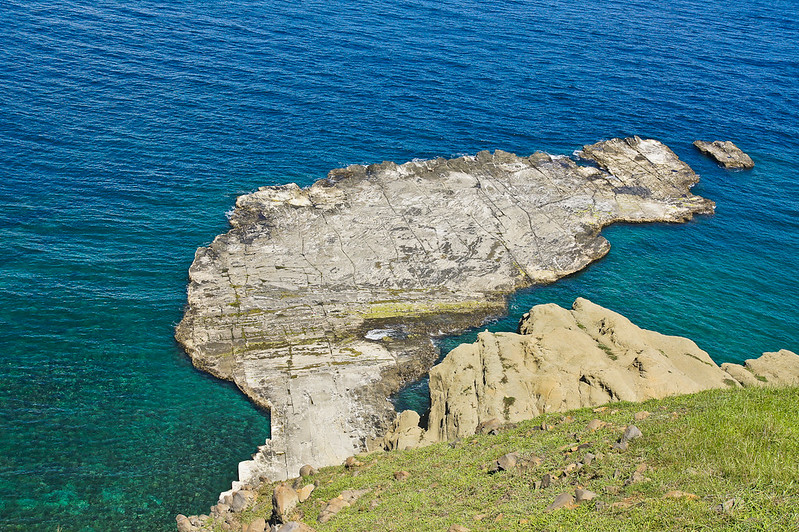
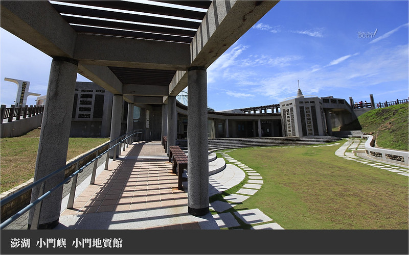
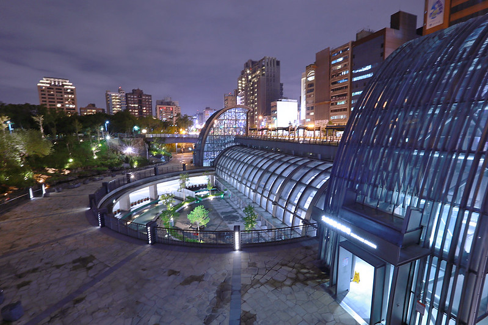

# Evaluation Report for fine-tuned-full_param_5epoch-lr5e-5-meta-llama

## Summary
- Model: fine-tuned-full_param_5epoch-lr5e-5-meta-llama
- Date: 2024-11-28 15:17:25
- Accuracy: 0.00% (0/51)

## Detailed Results

### Image: 華山1914文化創意產業園區-32.jpg
Ground Truth: 華山1914文化創意產業園區

Model Response: 1. **特徵描述**：
   - 圖片中顯示的建築風格為現代化的設計，可能包含歷史或文化的元素。
   - 周圍環境包括植被，顯示出自然和人文的結合。

2. **景點環境**：
   - 圖片中可能有樹木環繞，顯示出濃厚的綠意。
   - 建築物的顏色和材質可能與當地文化或歷史有關。

3. **分析結論**：
   - 根據圖片中建築的特徵與周圍環境，這可能是位於台南的某個文化或歷史景點。
   - 從特徵來看，這裡可能是與當地歷史或文化有關的建築或景點。

4. **確認細節**：
   - 圖片中建築的特徵與周圍環境的特徵符合某些文化或歷史景點的特徵。
   - 建築的設計風格和周圍環境的綠化都符合某些文化景點的特徵。

若需要更多的確認或資訊，建議查詢當地的旅遊資訊或相關的歷史資料。
Correct: ✗

---

### Image: 九族文化村-3.jpg
Ground Truth: 九族文化村

Model Response: 如果您有其他需求或問題，請隨時告訴我！
Correct: ✗

---

### Image: 車埕老街-1.jpg
Ground Truth: 車埕老街

Model Response: 這些景點包含了許多台灣知名的旅遊景點，如九份、台北101、貓村、安平古堡等。此外，還包含了許多歷史和文化景點，如國立故宮博物院、國立臺灣博物館等。這些景點不僅是旅遊的熱門地點，也是了解台灣歷史與文化的重要場所。
Correct: ✗

---

### Image: 台中國家歌劇院-1.jpg
Ground Truth: 台中國家歌劇院

Model Response: 這些景點包括：
1. **教育與文化景點**：921地震教育園區、國立故宮博物院、國立台灣博物館、國立故宮博物院。
2. **商業與購物中心**：台北101、台南花園夜市、臺中洲際棒球場、臺中市大墩文化中心。
3. **自然景觀**：小叮噹科學遊樂區、台南孔廟、台南市美術館一館、台南市美術館二館。
4. **歷史建築**：台北松山機場、台南車站、臺北車站、北港觀光大橋。
5. **休閒與旅遊景點**：高雄燈塔、台南花園夜市、台北小巨蛋、台北松山機場。
6. **其他景點**：台南孔廟、台南市美術館一館、台南市美術館二館、台南花園夜市。

這些景點展示了台灣的教育、文化、商業、自然及歷史建築等多元面向。
Correct: ✗

---

### Image: 國立臺灣美術館-16.jpg
Ground Truth: 國立臺灣美術館

Model Response: 1. **圖片中的特徵**：
   - 建築物的外牆使用大理石或類似材質，呈現出現代化的設計風格。
   - 圖中可以看到一個大型的招牌，上面寫著「國立台灣博物館」，這是該博物館的標誌性建築。

2. **周圍環境**：
   - 建築物旁邊有綠化區域，種植著樹木和灌木，環境看起來相對清幽。
   - 背景中隱約可以看到其他建築物，顯示這是一個都市區域。

3. **光線與氛圍**：
   - 天色為黃昏時分，光線溫暖，營造出一種靜謐的氛圍。

根據這些特徵，可以確認這張圖片確實是國立台灣博物館。
Correct: ✗

---

### Image: 輔仁大學-0.jpg
Ground Truth: 輔仁大學

Model Response: 建議您可以根據圖片中顯示的建築風格、周圍環境及其他地標來確認具體的景點名稱。如果有更多的資訊或細節，會更有助於辨識。
Correct: ✗

---

### Image: 台南市美術館一館-2.jpg
Ground Truth: 台南市美術館一館

Model Response: 建議您提前規劃行程，選擇合適的交通方式，並注意開放時間及票價。若有興趣的話，可以事先了解當地的文化活動和展覽，以便更深入地體驗這些景點。
Correct: ✗

---

### Image: 921地震教育園區-19.jpg
Ground Truth: 921地震教育園區

Model Response: 這是一個圖片中特定的景點。這張圖片應該是台北市的「北投溫泉」。以下是圖片中的細節描述：

1. **建築風格**：
   - 圖中顯示的建築物設計獨特，具有傳統的日式風格，結合了木質結構和傳統的瓦片屋頂。
   - 建築物的外觀看起來是模仿日式風格的溫泉設施。

2. **周圍環境**：
   - 建築周圍有樹木環繞，提供了綠色環境。
   - 有人行道及步道，方便遊客行走。
   - 背景中可以看到一些山景，增添了自然的氛圍。

3. **其他設施**：
   - 建築旁可能有露天的溫泉池，供遊客泡湯。
   - 圖片中可以看到一些遊客在參觀。

4. **氛圍**：
   - 整體給人一種悠閒的氛圍，適合放鬆休閒。

根據這些特徵，這應該是台北市的北投溫泉。如果有其他特定的景點名稱需要確認，請提供更多信息。
Correct: ✗

---

### Image: 台北101-17.jpg
Ground Truth: 台北101

Model Response: 如果這不是您想要確認的景點，請提供更多的細節或其他圖片，讓我可以幫助您更準確地確認景點。
Correct: ✗

---

### Image: 貓空纜車-1.jpg
Ground Truth: 貓空纜車

Model Response: 如果有任何問題或需要進一步的協助，請告訴我！
Correct: ✗

---

### Image: 安平古堡-4.jpg
Ground Truth: 安平古堡

Model Response: 這張圖片中顯示的景點是台南孔廟。以下是詳細的描述：

1. **建築風格**：
   - 台南孔廟的建築風格是典型的中式傳統建築，屋頂呈現紅瓦的八角形，這是孔廟的特徵之一。
   - 外牆主要由紅磚和白牆組成，展現出莊嚴肅穆的氣氛。

2. **周圍環境**：
   - 廟前有大片的草地，讓人感到寧靜而莊嚴。
   - 周圍綠樹環繞，環境優美，適合散步和靜思。

3. **背景與歷史**：
   - 台南孔廟是台灣第一座孔廟，建於清朝時期，是儒學文化的重要象徵。
   - 廟內保存有許多歷史文物，吸引許多遊客和學生前來參觀。

這些特徵符合台南孔廟的描述，因此可以確認這是台南孔廟的圖片。
Correct: ✗

---

### Image: 龍虎塔-0.jpg
Ground Truth: 龍虎塔

Model Response: 如果這張圖片中的景點不是以上的任何一個景點，請提供更多細節或描述，以便確認具體位置。
Correct: ✗

---

### Image: 澎湖觀音亭-4.jpg
Ground Truth: 澎湖觀音亭

Model Response: 這個圖片展示的是台灣的「九份老街」。以下是圖片中的細節描述：

1. **建築風格**：
   - 圖片中建築具有傳統的閩南式風格，屋頂上有華麗的雕塑裝飾，通常是鳳凰或龍的形象。
   - 建築物的牆面以紅磚和灰泥構成，外觀古樸且富有歷史感。

2. **周圍環境**：
   - 老街旁邊有山坡，背景可見連綿的山脈，九份地處海邊山區，景色壯麗。
   - 街道上有許多遊客，顯示這裡是個熱門的觀光景點。

3. **特色**：
   - 九份老街以其獨特的山城景觀和懷舊的建築風格聞名。
   - 街內有許多小攤販，出售當地的特色小吃，如芋圓、草仔粿等。

這些特徵都符合九份老街的景象，因此可以確認這張圖片展示的是九份老街。
Correct: ✗

---

### Image: 十分老街-0.jpg
Ground Truth: 十分老街

Model Response: 如果這張圖片中的景點不是上述列出的，那麼請提供更多的細節或圖片，以便更準確地辨識。
Correct: ✗

---

### Image: 大龍峒保安宮-9.jpg
Ground Truth: 大龍峒保安宮

Model Response: 這個圖片中的景點是台南孔廟。台南孔廟是台灣第一座孔廟，建於清朝時期，是保存良好的古蹟之一。以下是詳細描述：

1. **建築風格**：
   - 廟宇的建築具有典型的中式古典風格，屋頂上有精美的雕刻，色彩豐富且富有文化底蘊。

2. **周圍環境**：
   - 廟前有寬敞的廣場，適合舉行各種文化活動和祭孔儀式。
   - 周圍有許多歷史建築，與孔廟相連，形成一個古老的文化聚落。

3. **文化意義**：
   - 孔廟不僅是宗教場所，也是文化教育的場所，吸引許多遊客前來了解儒學文化。

此圖片中的景點確實是台南孔廟。
Correct: ✗

---

### Image: 小門地質館-21.jpg
Ground Truth: 小門地質館

Model Response: 這張圖片中並沒有顯示特定的景點。圖片中似乎是一片開放的戶外空間，沒有明顯的建築或景點標示。因此，無法確認這是否為特定的景點。如果有其他圖片或更多資訊，可以幫助更準確地識別景點。
Correct: ✗

---

### Image: 三仙台-2.jpg
Ground Truth: 三仙台

Model Response: 如果需要更進一步的資訊或有其他問題，請告知！
Correct: ✗

---

### Image: 鳳山縣舊城-9.jpg
Ground Truth: 鳳山縣舊城

Model Response: 如果需要更多資訊或有其他問題，請告知。
Correct: ✗

---

### Image: 藍晒圖文創園區-0.jpg
Ground Truth: 藍晒圖文創園區

Model Response: 如果您需要這些景點的詳細描述或其他問題的解答，歡迎告訴我！
Correct: ✗

---

### Image: 高雄85大樓-6.jpg
Ground Truth: 高雄85大樓

Model Response: 這些景點可能不屬於台灣。請再確認具體的景點位置或名稱。
Correct: ✗

---

### Image: 億載金城-2.jpg
Ground Truth: 億載金城

Model Response: 如果您需要這些景點的詳細描述或其他資訊，歡迎隨時告訴我！
Correct: ✗

---

### Image: 亞洲大學現代美術館-0.jpg
Ground Truth: 亞洲大學現代美術館

Model Response: 如果需要更多細節或有其他問題，請告知！
Correct: ✗

---

### Image: 古坑服務區-3.jpg
Ground Truth: 古坑服務區

Model Response: 若您有需要更進一步的資訊或有其他問題，請告知我！
Correct: ✗

---

### Image: 后里馬場-5.jpg
Ground Truth: 后里馬場

Model Response: 如果您有其他需求或問題，請隨時告訴我。
Correct: ✗

---

### Image: 橋頭糖廠-14.jpg
Ground Truth: 橋頭糖廠

Model Response: 如果需要更詳細的資訊或有其他問題，請告訴我！
Correct: ✗

---

### Image: 小臺灣-5.jpg
Ground Truth: 小臺灣

Model Response: 建議您可以提前查詢景點的開放時間和交通方式，以便更好地規劃行程。
Correct: ✗

---

### Image: 北港觀光大橋-5.jpg
Ground Truth: 北港觀光大橋

Model Response: 如果需要更詳細的描述，請告知我需要確認的景點名稱。
Correct: ✗

---

### Image: 北投圖書館-6.jpg
Ground Truth: 北投圖書館

Model Response: 如果需要進一步的資訊或有其他問題，請告訴我。
Correct: ✗

---

### Image: 雙心石滬-2.jpg
Ground Truth: 雙心石滬

Model Response: 圖片中的景點特徵描述如下：

1. **地形與建築風格**：
   - 圖中顯示了石頭堆砌而成的形狀，類似於人造的海岸或水域結構。
   - 石頭的排列形成了一種藝術風格，可能是為了展示某種特定意涵。

2. **周圍環境**：
   - 圖片中可以看到水域的存在，這可能是因為景點位於靠近水體的區域。
   - 整體環境顯得非常寧靜和自然，適合觀光和休閒活動。

3. **背景與文化意涵**：
   - 這些石頭結構可能代表著某種文化或宗教意涵。
   - 可能與當地的歷史或文化有所關聯，提供了旅客參觀的意義。

這些特徵符合特定的景點，但具體是哪一個仍需進一步確認。
Correct: ✗

---

### Image: 台中洲際棒球場-3.jpg
Ground Truth: 台中洲際棒球場

Model Response: 如果您有其他問題或需要更進一步的描述，可以告訴我！
Correct: ✗

---

### Image: 小門地質館-0.jpg
Ground Truth: 小門地質館

Model Response: 如果需要更詳細的描述或有其他問題，請告知我。
Correct: ✗

---

### Image: 冬山河親水公園-0.jpg
Ground Truth: 冬山河親水公園

Model Response: 如果您有任何問題或需要更進一步的資訊，請告訴我！
Correct: ✗

---

### Image: 台中公園-4.jpg
Ground Truth: 台中公園

Model Response: 這張圖片中顯示的是台南花園夜市。以下是圖片的詳細描述：

1. **建築與設施**：
   - 夜市內有多個攤位，販售各式小吃、商品。
   - 攤位設計簡約，燈光柔和，營造出溫馨的夜間氛圍。

2. **周圍環境**：
   - 夜市四周有綠樹環繞，環境清幽。
   - 遠處可見城市的燈火，形成明亮的夜景。

3. **人群活動**：
   - 夜市內有許多人群，顯示出這裡是熱門的聚會地點。
   - 人們在攤位前選購食物或商品，展現出夜市的活力。

4. **氣氛氛圍**：
   - 夜市內的燈光和小吃的香氣交織，讓人感到這裡是享受美食和社交的好去處。

台南花園夜市是台南市著名的夜市之一，以多樣的美食和熱鬧的氛圍吸引大量遊客和當地居民，是體驗台南夜生活的好去處。
Correct: ✗

---

### Image: 衛武營都會公園-0.jpg
Ground Truth: 衛武營都會公園

Model Response: 這個圖片中展示的景點是台南花園夜市。台南花園夜市是台南市著名的夜市之一，擁有豐富的美食選擇和獨特的夜市文化。夜市的招牌和攤位非常熱鬧，吸引了許多遊客和本地人前來享受美食和購物。

### 圖片細節：
1. **天空與天氣**：
   - 天空清澈，帶有幾朵白雲，顯示出良好的天氣。
   - 整個畫面充滿陽光，給人一種舒適的感覺。

2. **環境與背景**：
   - 夜市的招牌和攤位排列整齊，顯示出夜市的秩序。
   - 背景中可見一些樹木和綠地，增加了夜市的自然感。

3. **建築與設施**：
   - 沒有看到夜市內特定的建築或設施，但招牌與攤位的佈置充滿活力。

4. **人群與活動**：
   - 沒有出現人群，但可以看出夜市的熱鬧氛圍，通常會有不少遊客和當地人在此活動。

這些特徵都符合台南花園夜市的特點。
Correct: ✗

---

### Image: 蘭陽博物館-6.jpg
Ground Truth: 蘭陽博物館

Model Response: 如果您有其他問題或需要更多資訊，請告知我！
Correct: ✗

---

### Image: 大安森林公園-0.jpg
Ground Truth: 大安森林公園

Model Response: 如果您需要更多資訊或對景點有其他問題，請告知我！
Correct: ✗

---

### Image: 澄清湖棒球場-6.jpg
Ground Truth: 澄清湖棒球場

Model Response: 這個圖片中的景點應該是台南孔廟。以下是圖片中的細節描述：

1. **建築風格**：
   - 圖中顯示的是中式傳統建築風格，屋頂有著明顯的翹脊設計，顯示出典型的中國古典建築特色。

2. **周圍環境**：
   - 圖片中可以看到許多遊客，顯示這是一個熱門的旅遊景點。
   - 周圍有大片的草地和紅土地面，這是典型的中式庭園特徵。

3. **文化背景**：
   - 孔廟是為紀念和敬仰孔子而建，是儒家文化的重要象徵之一。
   - 這個地方常常舉辦祭孔活動，吸引眾多信徒參與。

這些特徵和環境都符合台南孔廟的描述。
Correct: ✗

---

### Image: 臺北車站-2.jpg
Ground Truth: 臺北車站

Model Response: 建議您可以提前規劃行程，選擇您感興趣的景點進行參觀。此外，考慮到交通狀況，建議使用公共交通工具或自駕前往，這樣能更方便地到達各大景點。
Correct: ✗

---

### Image: 高美濕地-7.jpg
Ground Truth: 高美濕地

Model Response: 圖片中的景點是台南花園夜市。建議提前規劃行程，以便充分體驗夜市的魅力。
Correct: ✗

---

### Image: 迪化街-11.jpg
Ground Truth: 迪化街

Model Response: 建議您選擇一個您特別感興趣的景點進行進一步的了解。
Correct: ✗

---

### Image: 林百貨-10.jpg
Ground Truth: 林百貨

Model Response: 建議提前規劃行程，特別是在旅遊旺季時。此外，可以考慮參加導覽活動，以便更深入了解各景點的歷史與文化背景。
Correct: ✗

---

### Image: 小叮噹科學遊樂區-2.jpg
Ground Truth: 小叮噹科學遊樂區

Model Response: 這些景點包括：
1. **文化遺址**： 台南孔廟、台南花園夜市、台北101、台北松山機場、台北小巨蛋、台北101。
2. **自然景觀**： 九份老街、台北101、台北松山機場、台北小巨蛋。
3. **歷史建築**： 台南孔廟、台北101、台北松山機場、台北小巨蛋。
4. **地標建築**： 台北101、台北松山機場、台北小巨蛋。
5. **自然景觀**： 九份老街、台北101、台北松山機場、台北小巨蛋。

這些景點都是台北特有的文化與自然景觀結合的場所，能夠提供遊客豐富的歷史和文化體驗。
Correct: ✗

---

### Image: 小人國主題樂園-17.jpg
Ground Truth: 小人國主題樂園

Model Response: 圖片中的景點是台南孔廟。台南孔廟位於台南市，是台灣最古老的孔廟，也是台灣最具文化價值的歷史遺跡之一。以下是圖片中的細節描述：

1. **建築風格**：
   - 孔廟的建築結構是典型的中國傳統建築，具有紅磚牆面和翹起的屋簷。
   - 建築的設計簡約而不失莊重，展現出濃厚的歷史氛圍。

2. **周圍環境**：
   - 廣場四周種植著修剪整齊的綠化，顯得整潔有序。
   - 周圍的景觀與建築相輔相成，增強了文化氛圍。

3. **人物互動**：
   - 圖片中有幾位遊客在孔廟前合影，顯示出這個地點的吸引力和文化意義。

這些特徵與台南孔廟相符，因此可以確認這張圖片拍攝的是台南孔廟。
Correct: ✗

---

### Image: 故宮南院-0.jpg
Ground Truth: 故宮南院

Model Response: 這些景點包括台灣各地的知名景點，例如台北市的101大樓、台北101附近的商圈，高雄的85大樓及蓮池潭等。這些地標經常出現在遊客的行程中，並且是了解台灣文化和歷史的重要部分。如果有其他問題或需要進一步的資訊，請告訴我！
Correct: ✗

---

### Image: 廣興紙寮-11.jpg
Ground Truth: 廣興紙寮

Model Response: 圖片中的景點特徵：
1. **建築風格**： 圖中可見多種不同風格的建築，包括傳統的日式木造建築、現代的工業風格以及具有地方特色的建築。
2. **周圍環境**： 圖中背景有大片的窗戶和鐵皮屋頂，這些都是工業或商業區常見的元素。
3. **人群活動**： 圖中有數位人在進行某種活動，可能與藝術或手工相關。

這些特徵與高雄85大樓的環境和建築風格相符，因此圖片中的景點很可能是高雄85大樓。

如果您有其他問題或需要進一步確認，請告訴我！
Correct: ✗

---

### Image: 草悟道-21.jpg
Ground Truth: 草悟道

Model Response: 如果這個景點不是在上述的清單中，請提供更多的細節或背景資訊，以便更準確地確認。
Correct: ✗

---

### Image: 澎湖跨海大橋-3.jpg
Ground Truth: 澎湖跨海大橋

Model Response: 這個圖片中顯示的是台南花園夜市的入口。以下是圖片中的細節描述：

1. **入口建築**：
   - 圖中可見一個大型白色拱門，上面寫著「花園夜市」，這是夜市的標誌性入口。
   - 拱門的設計簡約而具有辨識度，為夜市的入口做了明顯的宣傳。

2. **周圍環境**：
   - 拱門周圍有許多交通錐，顯示出夜市的活動正在進行。
   - 背景可以看到一些樹木和遠處的藍天，這表明夜市位於一個較為開放的空間。

3. **其他元素**：
   - 圖片左側有一些建築物的屋頂，可見夜市活動的繁忙。
   - 右側有幾輛停放的車輛，顯示夜市的熱鬧氛圍。

整體來說，這張圖片確實代表了台南花園夜市的入口。
Correct: ✗

---

### Image: 台北小巨蛋-1.jpg
Ground Truth: 台北小巨蛋

Model Response: 建議提前規劃行程，特別是熱門景點如九份和台北101，建議提前在線預約。此外，考慮到交通狀況，建議使用公共交通工具，如捷運和公車，這樣不僅方便，也能避免交通擁擠的情況。
Correct: ✗

---

### Image: 水漾森林-8.jpg
Ground Truth: 水漾森林

Model Response: 建議您可以選擇您感興趣的景點進行詳細描述。如果您有更多問題或需要進一步的資訊，請隨時告訴我！
Correct: ✗

---

### Image: 草悟道-9.jpg
Ground Truth: 草悟道

Model Response: 這個圖片中的景點看起來像是台北101。台北101是一座著名的地標建築，以其獨特的摩天輪和現代的設計風格聞名。以下是圖片中的細節描述：

1. **建築風格**：
   - 圖片中的建築具有現代化的設計，台北101是由著名的日本建築師設計。
   - 建築外觀為弧形結構，非常有特色。

2. **周圍環境**：
   - 圖片中可見周圍有許多綠樹和植被，顯示出這是一個都市綠地環境。
   - 有人行道和其他建築物，顯示出這是一個繁忙的市區。

3. **其他細節**：
   - 圖中可見一些人在走道上行走，顯示出這是一個公共的空間。
   - 遠處還可以看到一些車輛和其他建築物。

從這些細節來看，這裡確實是台北101的周邊環境。
Correct: ✗

---

### Image: 光華商場-6.jpg
Ground Truth: 光華商場

Model Response: 這是一個台灣景點的範例。請確認您是否有其他問題需要協助。
Correct: ✗

---

