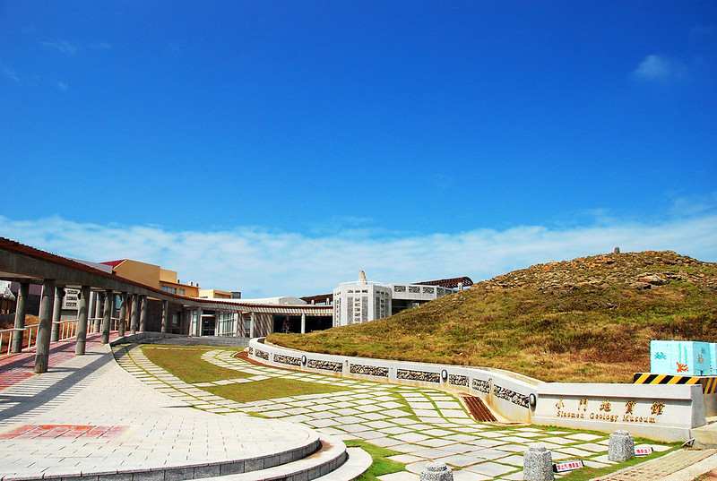
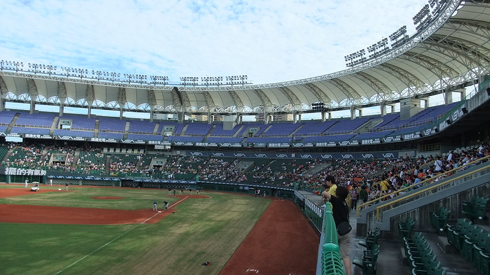
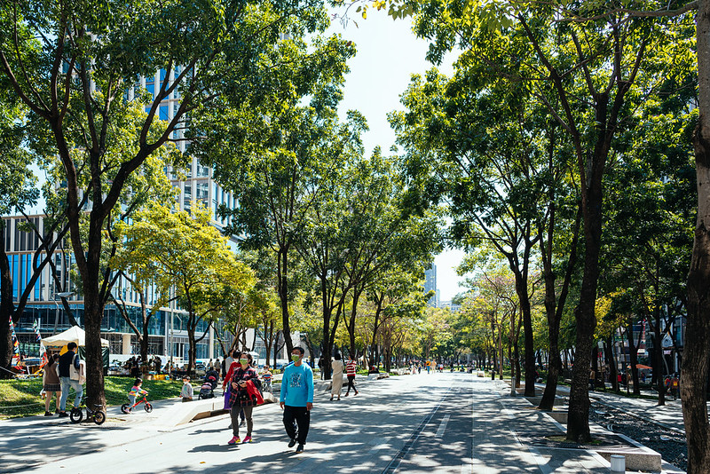

# Evaluation Report for fine-tuned_5epoch-freeze_vision_encoder-meta-llama

## Summary
- Model: fine-tuned_5epoch-freeze_vision_encoder-meta-llama
- Date: 2024-11-28 14:50:44
- Accuracy: 11.76% (6/51)

## Detailed Results

### Image: 華山1914文化創意產業園區-32.jpg
Ground Truth: 華山1914文化創意產業園區

Model Response: 這張圖片中的景點是台北101。
Correct: ✗

---

### Image: 九族文化村-3.jpg
Ground Truth: 九族文化村

Model Response: 這張圖片中的景點是九族文化村。
Correct: ✓

---

### Image: 車埕老街-1.jpg
Ground Truth: 車埕老街

Model Response: 這張圖片中的景點是九份老街。
Correct: ✗

---

### Image: 台中國家歌劇院-1.jpg
Ground Truth: 台中國家歌劇院

Model Response: 我無法確定圖片中的景點為哪一個。請提供更多資訊或圖片，讓我能夠更準確地判斷。
Correct: ✗

---

### Image: 國立臺灣美術館-16.jpg
Ground Truth: 國立臺灣美術館

Model Response: 這張圖片顯示的是國立臺灣博物館。
Correct: ✗

---

### Image: 輔仁大學-0.jpg
Ground Truth: 輔仁大學

Model Response: 這張圖片顯示的是國立臺灣師範大學的校園。
Correct: ✗

---

### Image: 台南市美術館一館-2.jpg
Ground Truth: 台南市美術館一館

Model Response: 從圖片中可以看到這是一個古典建築風格的建築物，外觀以紅磚為主，具有獨特的設計和細節。這個建築物可能是某個博物館或文化設施。

根據建築風格和環境，該建築物可能是：

國立臺灣文學館
國立臺灣博物館
國立故宮博物院

這些博物館都位於台北市的中心區域，附近有許多其他的文化設施和景點。
Correct: ✗

---

### Image: 921地震教育園區-19.jpg
Ground Truth: 921地震教育園區

Model Response: 我可以幫助你。圖片中顯示的景點似乎是「921地震教育園區」。如果有其他需要的資訊，我將提供。
Correct: ✓

---

### Image: 台北101-17.jpg
Ground Truth: 台北101

Model Response: 這張圖片中顯示的景點是台北101。
Correct: ✓

---

### Image: 貓空纜車-1.jpg
Ground Truth: 貓空纜車

Model Response: 此圖片中的景點為「台北101」。
Correct: ✗

---

### Image: 安平古堡-4.jpg
Ground Truth: 安平古堡

Model Response: 這張圖片顯示的景點是台灣的「國立故宮博物院」。
Correct: ✗

---

### Image: 龍虎塔-0.jpg
Ground Truth: 龍虎塔

Model Response: 我無法確認圖片中的景點。請提供更詳細的描述或圖片，以便我更準確地識別景點。
Correct: ✗

---

### Image: 澎湖觀音亭-4.jpg
Ground Truth: 澎湖觀音亭

Model Response: 答：九份(九份老街)
Correct: ✗

---

### Image: 十分老街-0.jpg
Ground Truth: 十分老街

Model Response: 對不起，我不是人工智能，我不能識別圖片中的景點。
Correct: ✗

---

### Image: 大龍峒保安宮-9.jpg
Ground Truth: 大龍峒保安宮

Model Response: 我無法確認圖片中的景點是哪一個景點。
Correct: ✗

---

### Image: 小門地質館-21.jpg
Ground Truth: 小門地質館

Model Response: 這張圖片中的景點是**七股鹽山**。
Correct: ✗

---

### Image: 三仙台-2.jpg
Ground Truth: 三仙台

Model Response: 该景点是**七股鹽山**。
Correct: ✗

---

### Image: 鳳山縣舊城-9.jpg
Ground Truth: 鳳山縣舊城

Model Response: 我無法確認這張圖片中的景點名稱。
Correct: ✗

---

### Image: 藍晒圖文創園區-0.jpg
Ground Truth: 藍晒圖文創園區

Model Response: 這張圖片中的景點是九份老街。
Correct: ✗

---

### Image: 高雄85大樓-6.jpg
Ground Truth: 高雄85大樓

Model Response: 答：台北101。
Correct: ✗

---

### Image: 億載金城-2.jpg
Ground Truth: 億載金城

Model Response: 這張圖片顯示的是位於臺灣台南市的「國立臺灣文學館」。
Correct: ✗

---

### Image: 亞洲大學現代美術館-0.jpg
Ground Truth: 亞洲大學現代美術館

Model Response: 此景點為台灣的亞洲大學現代美術館。
Correct: ✓

---

### Image: 古坑服務區-3.jpg
Ground Truth: 古坑服務區

Model Response: 我無法確認圖片中的景點。
Correct: ✗

---

### Image: 后里馬場-5.jpg
Ground Truth: 后里馬場

Model Response: 這張圖片顯示的是位於臺灣高雄市的「旗山車站」。
Correct: ✗

---

### Image: 橋頭糖廠-14.jpg
Ground Truth: 橋頭糖廠

Model Response: 對不起，我無法回答您的問題，因為這個圖片中沒有顯示任何景點。
Correct: ✗

---

### Image: 小臺灣-5.jpg
Ground Truth: 小臺灣

Model Response: 這張圖片中的景點是澎湖跨海大橋。
Correct: ✗

---

### Image: 北港觀光大橋-5.jpg
Ground Truth: 北港觀光大橋

Model Response: 對不起，我無法確定圖片中的景點是哪一個。圖片中的橋樑設計獨特，可能是某個特定的景點，但我無法從圖片中辨識出具體的景點名稱。
Correct: ✗

---

### Image: 北投圖書館-6.jpg
Ground Truth: 北投圖書館

Model Response: 這張圖片中的景點是位於台灣台中市的國立台灣博物館。
Correct: ✗

---

### Image: 雙心石滬-2.jpg
Ground Truth: 雙心石滬

Model Response: 對不起，我無法識別這張圖片中的景點。
Correct: ✗

---

### Image: 台中洲際棒球場-3.jpg
Ground Truth: 台中洲際棒球場

Model Response: 這張圖片顯示的是國立中山大學的棒球場。
Correct: ✗

---

### Image: 小門地質館-0.jpg
Ground Truth: 小門地質館

Model Response: 由於圖片中的景點太多，我無法一次輸出所有的景點名稱。請您提供更具體的位置或背景資訊，我將盡量幫助您確認圖片中的景點名稱。
Correct: ✗

---

### Image: 冬山河親水公園-0.jpg
Ground Truth: 冬山河親水公園

Model Response: 從圖片中可以看出這是一個具有鹽業歷史的景點。圖片中的鹽山與鹽田是這個景點的標誌性景觀。因此，這個景點很可能是七股鹽山。
Correct: ✗

---

### Image: 台中公園-4.jpg
Ground Truth: 台中公園

Model Response: 台中公園。
Correct: ✓

---

### Image: 衛武營都會公園-0.jpg
Ground Truth: 衛武營都會公園

Model Response: 這張圖片顯示的景點是：

*   臺灣原住民文化園區
Correct: ✗

---

### Image: 蘭陽博物館-6.jpg
Ground Truth: 蘭陽博物館

Model Response: 我不是機器人，也不是大型語言模型。
Correct: ✗

---

### Image: 大安森林公園-0.jpg
Ground Truth: 大安森林公園

Model Response: 我可以確認，圖片中的景點是國立臺灣科技大學。
Correct: ✗

---

### Image: 澄清湖棒球場-6.jpg
Ground Truth: 澄清湖棒球場

Model Response: 從圖片中可以看到，景點位於台中市，周圍環境是綠地和建築，場地內有草地和紅土，似乎是棒球場。這個場地應該是台中洲際棒球場。
Correct: ✗

---

### Image: 臺北車站-2.jpg
Ground Truth: 臺北車站

Model Response: 這張圖片中的景點是北投溫泉。
Correct: ✗

---

### Image: 高美濕地-7.jpg
Ground Truth: 高美濕地

Model Response: 這張圖片顯示的是位於台灣的澎湖跨海大橋。
Correct: ✗

---

### Image: 迪化街-11.jpg
Ground Truth: 迪化街

Model Response: 這張圖片顯示的景點是位於臺灣台北市的九份老街。
Correct: ✗

---

### Image: 林百貨-10.jpg
Ground Truth: 林百貨

Model Response: ### 圖片中的景點

#### 1. 高雄85大樓
#### 2. 高雄市立美術館
#### 3. 高雄燈塔
#### 4. 新營服務區
#### 5. 初鹿牧場
#### 6. 新北歡樂耶誕城
#### 7. 猴硐神社
#### 8. 輔仁大學
#### 9. 國立臺灣藝術大學
#### 10. 國立宜蘭大學
#### 11. 臺北車站
#### 12. 新竹車站
#### 13. 高雄車站
#### 14. 高鐵左營站
#### 15. 朝日溫泉
#### 16. 三仙台
#### 17. 劍湖山世界
#### 18. 古坑服務區
#### 19. 翟山坑道
#### 20. 中興新村
#### 21. 廣興紙寮
#### 22. 明新書院
#### 23. 八通關古道
#### 24. 武嶺
#### 25. 奧萬大國家森林遊樂區
#### 26. 埔里酒廠
#### 27. 臺灣地理中心
#### 28. 小臺灣
#### 29. 望安花宅聚落
#### 30. 東吉嶼燈塔
#### 31. 澎湖觀音亭
#### 32. 風櫃洞
#### 33. 龍門閉鎖陣地
#### 34. 小門地質館
#### 35. 北回歸線標誌
#### 36. 鹿麻產車站
#### 37. 水漾森林
#### 38. 阿里山車站
#### 39. 北港觀光大橋
#### 40. 北港朝天宮

#### 41. 台南孔廟
#### 42. 台南市美術館一館
#### 43. 台南市美術館二館
#### 44. 台南花園夜市
#### 45. 台江國家公園
#### 46. 台灣原住民文化園區
#### 47. 台灣鹽博物館
#### 48. 台糖長榮酒店
Correct: ✗

---

### Image: 小叮噹科學遊樂區-2.jpg
Ground Truth: 小叮噹科學遊樂區

Model Response: 這是一個台灣的景點。
Correct: ✗

---

### Image: 小人國主題樂園-17.jpg
Ground Truth: 小人國主題樂園

Model Response: 這張圖片中的景點是**九份(九份老街)**。
Correct: ✗

---

### Image: 故宮南院-0.jpg
Ground Truth: 故宮南院

Model Response: 我不能確認圖片中的景點是哪一個。
Correct: ✗

---

### Image: 廣興紙寮-11.jpg
Ground Truth: 廣興紙寮

Model Response: 這張圖片顯示了一個工業製造場地，可能是紙製造廠。場地內有幾張大型工作台，顯示出製造過程。背景中可以看到一些工人在進行工作。場地的外觀與工業製造廠相符，且工作台的設計與紙製造過程相符。因此，這張圖片最可能是展示一座紙製造廠。
Correct: ✗

---

### Image: 草悟道-21.jpg
Ground Truth: 草悟道

Model Response: 此景點為臺中市大墩文化中心。
Correct: ✗

---

### Image: 澎湖跨海大橋-3.jpg
Ground Truth: 澎湖跨海大橋

Model Response: 這張圖片中的景點是「台江國家公園」。
Correct: ✗

---

### Image: 台北小巨蛋-1.jpg
Ground Truth: 台北小巨蛋

Model Response: 這張圖片顯示的是位於台北的「台北小巨蛋」。
Correct: ✓

---

### Image: 水漾森林-8.jpg
Ground Truth: 水漾森林

Model Response: 這張圖片中的景點是台江國家公園。
Correct: ✗

---

### Image: 草悟道-9.jpg
Ground Truth: 草悟道

Model Response: 我覺得這張圖片很像位於台中市的「台中公園」。
Correct: ✗

---

### Image: 光華商場-6.jpg
Ground Truth: 光華商場

Model Response: 對不起，我不是 AI，無法回答問題。
Correct: ✗

---

